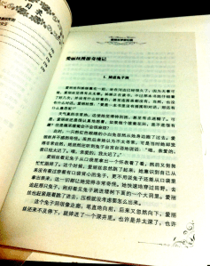
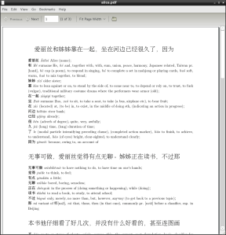
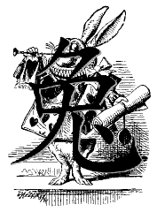

The other day I picked up my Chinese copy of Alice in Wonderland that I picked up in Beijing last year. My intention was to lay in the sun by the lake until I had finished the first page, using the dictionary as needed to achieve basic comprehension. The result was a bad sunburn and only two of four paragraphs finished. What went wrong?

<!-- more -->

Given my limited knowledge of Chinese vocabulary, most of my time reading is spent looking up unknown characters and phrases in a dictionary. Using [CEDICT](https://en.wikipedia.org/wiki/CEDICT) on the iPhone is far faster than looking up in a dead-trees tome, but it still is incredibly time-consuming. About an hour into my Alice reading session, I realized that my process of looking up characters and words in the dictionary was quite methodical, and would be easily automated. So, I began work on an **Automatic Foreign Language Annotation Tool** (German: *Fremdspracheannotationswerkzeug*, or **SAWZ** for short). The tool will have the following features:

- written in Python
- takes Unicode plaintext as input
- looks up every "unfamiliar" word and generates an annotation
- annotations appear as either footnotes or marginal glosses to minimize interruption to reading
- generates a [TeX](https://en.wikipedia.org/wiki/TeX) source file for rendering by pdflatex into a PDF

I hacked a preliminary version of the program over the weekend. It generates annotated PDFs. Here's an example:

Already this program could be useful. However, it clearly gives far too much annotation. The primary improvements that I would like to implement are:

- **word disambiguation** to allow annotation with only the most correct dictionary entry, resulting in a traditional one-word marginal gloss
- **an ignore list** filled with words that the reader already knows to reduce the number of annotations

Implementing the disambiguation would be a non-trivial task of [NLP](https://en.wikipedia.org/wiki/Natural_language_processing), which I'm up for. However, I have a bit to learn before I can attempt it. The ignore list is easy -- it just requires a list or lists of words sorted by difficulty (or order that they are learned). The words learned in Rosetta Stone, the [HSK](https://en.wikipedia.org/wiki/Hanyu_Shuiping_Kaoshi) lists, and/or in Wheatley's course make good starting points. [Frequency analysis](https://en.wikipedia.org/wiki/Frequency_analysis) of phrases from some corpus could also be useful data in determining when to annotate.

As usual, if anyone is interested in this program, please email me and I'd be glad to share it with you.

---

After writing this program, I found [this thread](http://www.chinese-forums.com/index.php?/topic/32817-plaintext-annotatormass-dictionary-lookup/) which links to two online annotation tools:

- [zhtoolkit](http://www.zhtoolkit.com/apps/wordlist/create-list.cgi)
- [MandarinSpot Annotate](http://mandarinspot.com/annotate) -- try the "For Printing" option

These tools are available now, and work quite well. The MandarinSpot tool has a decent print mode, although it will not generate beautifully typeset PDFs like LaTeX will.

---

*Originally published on [Quasiphysics](https://quasiphysics.wordpress.com/2011/07/20/automated-annotation-tool/).*
