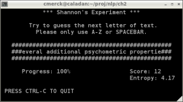

Over the past few days I've worked through Chapter 2 of Foundations (Manning and Schuetze), including writing a Python program to reproduce [Shannon's Experiment](https://en.wikipedia.org/wiki/Shannon%27s_source_coding_theorem).

<!-- more -->

My solutions to the Chapter 2 exercises, including some rants about computing [entropy](https://en.wikipedia.org/wiki/Entropy_(information_theory)) empirically, are to be found in the PDF for chapter 2 on my [FSNLP page](https://quasiphysics.wordpress.com/fsnlp/).

It is still unclear to me how exactly Shannon computed entropy in his experiment. I've experimented with a few different methods, but I'm not quite satisfied. Perhaps the [original paper](https://en.wikipedia.org/wiki/A_Mathematical_Theory_of_Communication) would help?

---

*Originally published on [Quasiphysics](https://quasiphysics.wordpress.com/2011/07/12/chapter-2-of-fsnlp-shannons-experiment-et-al/).*
