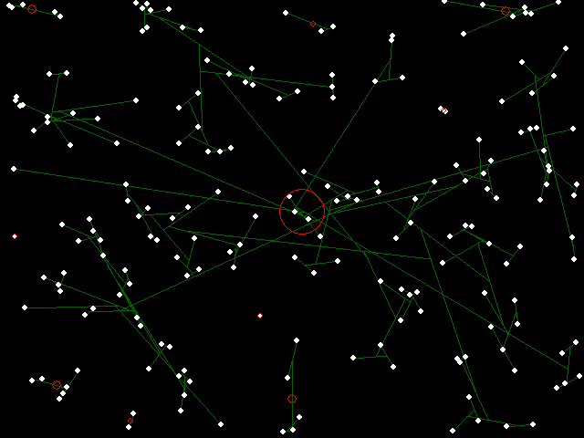
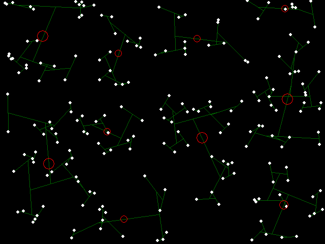
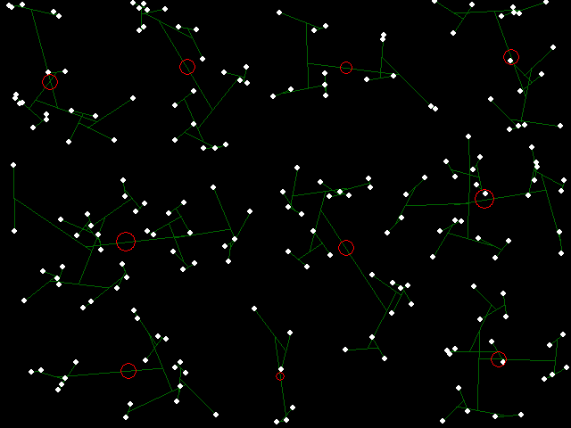
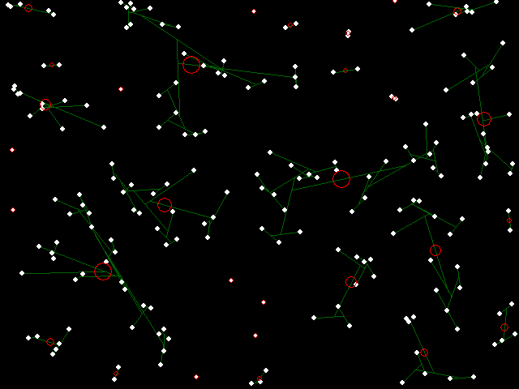
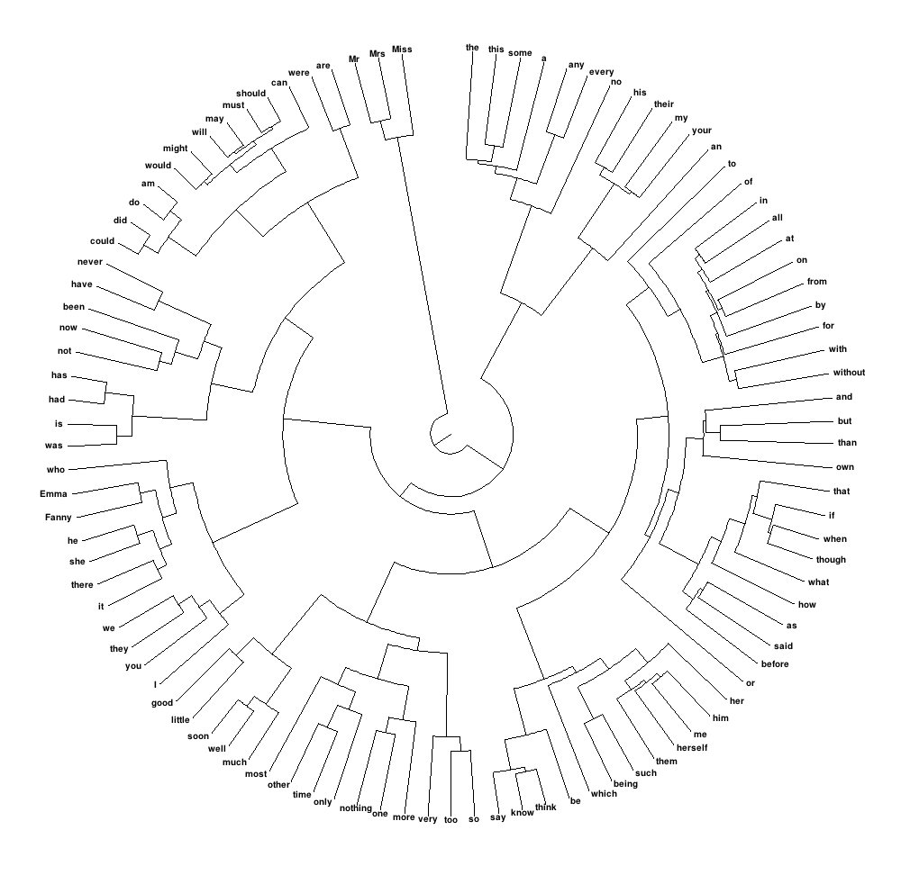
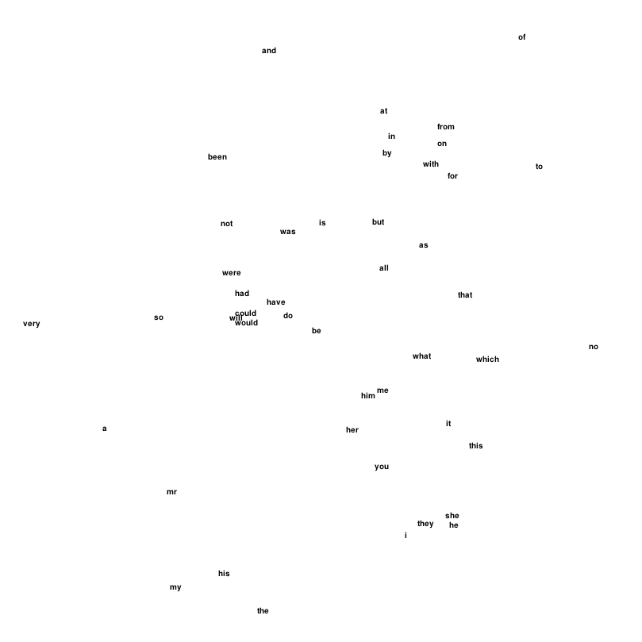

I'm curious about unsupervised [word sense disambiguation](https://en.wikipedia.org/wiki/Word-sense_disambiguation), and unsupervised machine learning in general. For that, Manning and Schuetze tell us we need [clustering](https://en.wikipedia.org/wiki/Cluster_analysis).

<!-- more -->

## A Survey of Clustering Algorithms

I generated some random 2D points and applied various [hierarchical clustering](https://en.wikipedia.org/wiki/Hierarchical_clustering) algorithms, using inverse Euclidean distance as the similarity metric. I visualized the results using pygame/python, with each algorithm configured to produce $k = 10$ clusters.

**Key to the figures:** White dots are elements to be clustered. Red circles are cluster centers, where the area of a circle is proportional to the number of elements in the cluster. Green lines show cluster membership and hierarchy.

*Single-link binary hierarchical clustering of random points in 2-space. Note that most points have merged into a single cluster.*

*Complete-link binary hierarchical clustering of random points in 2-space.*

*Group-average binary hierarchical clustering of random points in 2-space.*

*Single-link clustering, but with $k = 35$. This higher $k$ brings the results more into agreement with the other algorithms for comparison purposes.*

## Dendrogram of Common English Words

I then applied [complete-link clustering](https://en.wikipedia.org/wiki/Complete-linkage_clustering) to the 100 most common words from [Jane Austen](https://en.wikipedia.org/wiki/Jane_Austen)'s complete works, attempting to replicate an analysis from Manning and Schuetze's textbook. The similarity function measures the overlap between [bigram](https://en.wikipedia.org/wiki/Bigram) distributions for words immediately preceding and following the words in question:

$$\text{sim}(a, b) = \frac{\sqrt{\sum_k P(k,a) P(k,b) \cdot \sum_k P(a,k) P(b,k)}}{P(a) P(b)}$$

I precomputed a similarity matrix covering the 300 most common words for efficiency. The resulting [dendrogram](https://en.wikipedia.org/wiki/Dendrogram) was too wide to display linearly, so I reformatted it as a circular "polar dendrogram":

*Polar Dendrogram of Complete-Link Clustering of the 100 Most Common Words in Jane Austen's Works. Similarity is intuitively defined as the overlap between the bigram distributions for words immediately preceding and following the words in question. Note in particular the accurate separation of prepositions from conjunctions.*

## Embedding in 2-Space

I also investigated 2D embedding techniques for visualization. One approach uses a dampened differential system that treats word pairs as particles with attractive and repulsive forces, optimizing for inverse-similarity distances. The idea is to find positions where the Euclidean distance between words reflects their inverse similarity.

*Embedding of common words obtained using a soft attractive force plus a force which strongly repels words which approach closer than $1/\text{sim}$ pixels from each other.*

The approach faces significant challenges: higher-dimensional data resists meaningful compression into two dimensions, limiting practical utility despite improved cluster visualization potential.

Source code available upon request.

*Originally published on [Quasiphysics](https://quasiphysics.wordpress.com/2011/08/17/clustering-jane-austen/).*
