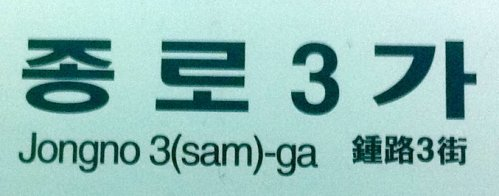
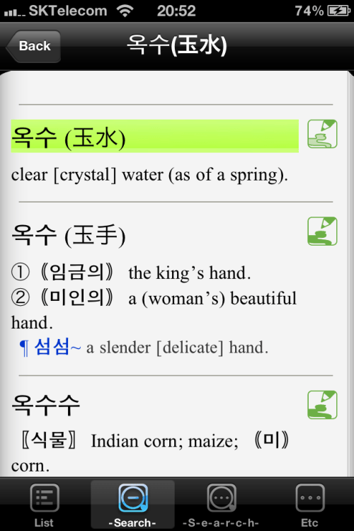
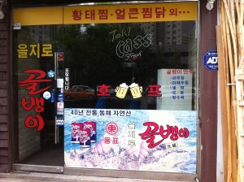
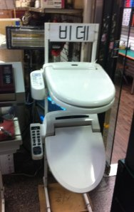
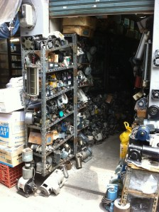
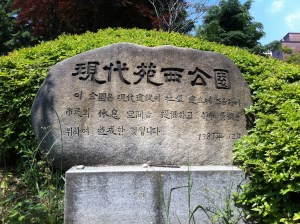

So I've spent the past few days in Seoul, and I can't help but pay attention to the written language, especially after an engaging conversation on the subject last night. Going in knowing little to nothing about Korean, a few things struck me in particular about the writing.

<!-- more -->

## Hanja for Place Names

On the subway, each stop has a name which is written in three scripts. I pulled an example out of a photo I took, of the stop called "Jongno 3-ga":

An example I like better though, but which I neglected to take a picture of, is the stop called "Oksu". The Chinese characters given for this stop literally mean "jade" and "water". Instead of a photo, here is a screencap from my iPhone dictionary that nicely enough gives the Chinese script as well:

What I wonder is, are the Chinese characters given chosen for their sound value to make the pronunciation easy for Chinese tourists (choosing from among the characters with the right phonetic value only for reasons of aesthetics or semantic suggestiveness), with the Korean being the original, or, as I suspect, are the Chinese characters given here actually [Hanja](https://en.wikipedia.org/wiki/Hanja), that is, Chinese characters which have been internalized into Korean as bona fide written expressions and given specific pronunciations and roles, quite analogously to the [Kanji](https://en.wikipedia.org/wiki/Kanji) of Japanese.

The answer seems to be more of a cultural than a linguistic one. If, as I suspect, the Chinese characters are the original way of writing the place names, it seems almost sad for the Korean language to lose that more rich written form, and descend into a [homography](https://en.wikipedia.org/wiki/Homograph) as rampant as the present [homophony](https://en.wikipedia.org/wiki/Homophone) (note how the readings for the "water" and "hand" Hanja are both "su"). On the other hand, the Korean alphabet has a smart, modern look, which, combined with the attractive sound of the simplified Korean pronunciation, makes forgetting the Hanja something like a breath of fresh air.

I would like for a native to weigh in on this one.

## Transcribed Foreign Words

Although it was only yesterday that I actually started (unintentionally) memorizing the phonetic Korean alphabet, I'm really shocked at how much I'm able to read and understand in the context of street and store-front signage. Even though I know effectively zero native Korean words, often by sounding out the Korean characters you can hear the foreign borrowings pop right out!

First example:

In the center of this pub window you see two frothing beer steins being toasted by some unseen pub-goers. Straddling the steins are two Korean characters with the romanization "Hopeu". Now, using what I'll call the Asian version of [Grimm's Law](https://en.wikipedia.org/wiki/Grimm%27s_law), Korean "eu" becomes Japanese "u". Furthermore, a "pu" can approximate a foreign "fu" given the lack (?) of that fricative in Korean. Lastly, when transcribing a foreign word which ends in a consonant, the Japanese will use a [mora](https://en.wikipedia.org/wiki/Mora_(linguistics)) with a final "u". Combining these rules we de-Koreanize (or rather, de-transcribe) "Hopeu" yielding "Hof". Et voila, the German word for "pub". I think it's just great how the Koreans have the advantage of a perspective where they can borrow from the appropriate language (German being the language of beer, making "Hof" a better word to Koreanize than, say, "Pub", much as the Japanese don't call it "buredu" but rather "pan", the French being the experts on bread; but don't get me started on the (horrific) quality of bread here).

A second image is left as an exercise for the reader:

## Hanja in their Full Glory

At the suggestion of the guy I sat next to on the plane from SFO, I went to see Anguk today (which, if you're curious, can be written in Hanja meaning "peaceful kingdom", or Mandarin "Anguo"). About half a mile outside and uphill from the madness that is the Anguk electronics and jewelry market (see photo), there is a quiet park where I sat, sipping my burnt-rice-flavored iced green tea in a bottle and munching on some tasty, conveniently-packaged pre-shelled chestnuts (also see photo), and watching a baker's dozen of elderly, suit-sporting Seoulites get quite animated over a game of croquet.

Bedelighting the stair at the entrance of the park is a stone bearing an inscription in a curious mode:

Notice in this inscription how, in addition to the heading being written in Chinese characters, we have Hanja in the descriptive text. In fact, there are more Hanja than Korean characters: I think this piece was a bit of a tour-de-force on the inscriber's part. Again, here I'd like the opinion of a native Korean as to how awkward or archaic or poetic this use of Hanja is to the modern reader.

## Calligraphy

One last thing that really caught my eye here in Seoul is the calligraphy. Beyond certain ceremonial and practical uses, Chinese characters in modern Korea seem to be used more for aesthetic or branding rather than semantic purposes. So, since people don't need to be able to read the character but only recognize it as a brand, it is common to see beautiful Chinese calligraphy on signs above businesses and on adverts (like atop the bar down the street from my hotel: the bar is called "violet" and uses as its logo a fabulously contoured manifestation of the Chinese character for "purple").

What's more, Korean characters are simple enough they may be highly stylized or written in extreme calligraphic form while remaining quite legible, and so you tend to see great diversity in the fonts and hands used to write Korean on signs and such. The most poignant example of this was a Chinese-style wall-hanging in COEX which took me several minutes to decode: it contained perhaps 30 different versions of the Korean "h" glyph. (The Korean "h" is written platonically as a dot above a horizontal stroke above a circle. It is not only symbolic, being the first sound in the name of the nation, but is also, in my uneducated opinion, the most calligraphically flexible of the Korean phonetic glyphs.)

---

By the way, I pulled the Korean 'h' picture from an [interesting blog post about the invention of Hangul](http://glyphs.webfoot.com/blog/2011/03/12/hangul-1446-ad-korea/). Unfortunately, in my brief search, I did not find any cursive versions of this glyph. So, when I make my upcoming "autocursive" program, I will start with the [Hangul](https://en.wikipedia.org/wiki/Hangul) 'h' as the platonic input.

---

I don't expect to dig any deeper into Korean, considering Mandarin is my primary focus and I'll be learning some Japanese in preparation for a trip to Kyoto this fall, but still it was great to get a glimpse into Korean culture and language in these few precious days.

---

*Originally published on [Quasiphysics](https://quasiphysics.wordpress.com/2011/05/27/curiousities-of-korean-writing/).*
