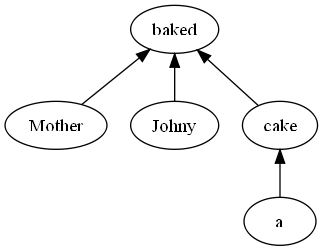
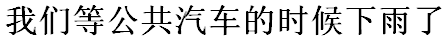
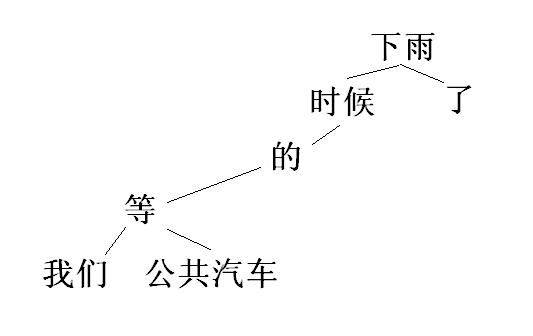
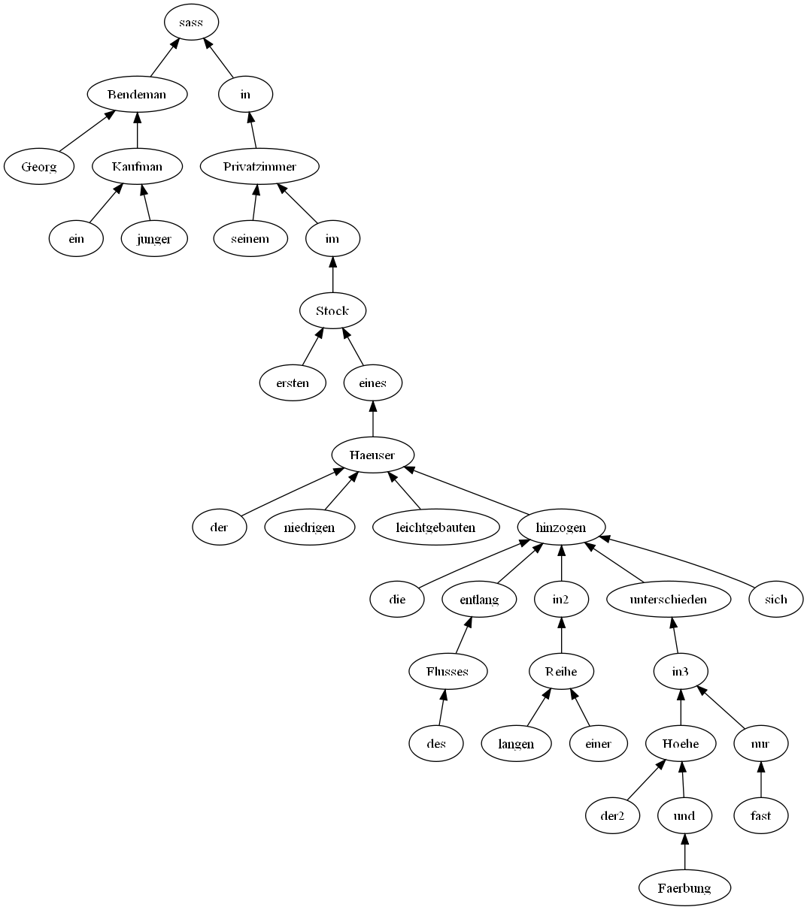

## Inception

While learning sentences in Chinese that introduce new grammatical concepts, I find it useful to draw lines between words to show their grammatical interrelationship (not to mention drawing brackets around the words, already a non-trivial task given the lack of spaces in Zhongwen). In the course of drawing these lines, I found myself breaking the words out of their ordinary position in the sentence so as to make the drawing of the [syntax tree](https://en.wikipedia.org/wiki/Parse_tree) of interconnected words more natural.

<!-- more -->

The result is a type of syntax tree diagram that I have never seen before. (Not to say that I have looked very hard.)

At any rate, be it novel or not, this technique is helping me learn Chinese. I've also experimented with this technique on English and German sentences with exciting results.

Here I'll just dump some examples of sentences decomposed using this informal syntax tree drawing technique that I'll call "easy syntax trees". As I delve deeper into the linguistics I will probably look back at this post and laugh at its naivete, but here goes anyhow.

## Simple English Example

As a first example, take the sentence "Mother baked Johny a cake." We can proceed either by a top-down approach or a sequential approach. First I'll look at the sequential approach: I consider the root node of the syntax tree for a complete sentence such as this to be the main verb, in this case "baked".

So, "baked" goes at the top of our diagram. Next we find any sub-phrases which modify "baked". Here we have "Mother" which modifies "baked" by providing the subject, "Johny" which provides the [indirect object](https://en.wikipedia.org/wiki/Indirect_object), and the phrase "a cake" which provides the [direct object](https://en.wikipedia.org/wiki/Direct_object).

We in turn break down the phrase "a cake" into the root "cake" and the modifier "a". Observe the resulting syntax tree:

A strength of this approach is that we can draw this diagram very quickly, and we don't need to make reference to the function of the various phrases -- totally bypassing much arcane language and many cryptic abbreviations that pervade traditional syntax trees.

## Chinese Example

I learned the other day how to form a sentence in Chinese which indicates that a past event occurred during some other event. The example I take has the loose English translation "It was raining while we waited for the bus."

(Or perhaps it would be better translated as "While we were waiting for the bus, it started to rain." Either way, I don't care at this point, because I'm focusing on a direct approach to learning Chinese: learning what to say in what situation and developing the ability to parse. Subtle semantics are at this point of no concern.) Here's the sentence in Zhongwen:

"Women deng gonggongqiche de shihou xiayu le."

And my easy syntax tree looks like this:

Note that I've left off the arrows indicating direction of the modification relationship, instead relying on relative vertical position (the modifying tree drawn below the modified node). Also, in this example at least, I've maintained the same horizontal ordering as in the sentence.

## German Example

I wanted to round the post out with a literary example. I take the second sentence from Kafka's [*Das Urteil*](https://en.wikipedia.org/wiki/The_Judgment):

*"Georg Bendemann, ein junger Kaufmann, sass in seinem Privatzimmer im ersten Stock eines der niedrigen, leichtgebauten Haeuser, die entlang des Flusses in einer langen Reihe, fast nur in der Hoehe und Faerbung unterschieden, sich hinzogen."*

And my easy syntax tree:

Note: this diagram was drawn using [GraphViz](https://en.wikipedia.org/wiki/Graphviz), and this is my first experiment with that software. If anyone knows how to set constraints on the horizontal position while allowing the vertical positions to be adjusted algorithmically, I would be much indebted if you would show me how!

## Where to go from here?

The linguist might like to add annotations to the arrows of my trees to specify what sort of modification is taking place, or, as I like to think of it, which "slot" of the parent word is being occupied by the child phrase.

We could also break out compound and inflected words into their component parts, drawing the modification relationships.

Even if I don't get overly technical with it, I will at least continue to use this technique to help get my mind around new Chinese grammar. I hope it will help someone else out too.

Stay tuned for Japanese examples, along with my amateur commentary on how the syntactic structure is related to [intonation](https://en.wikipedia.org/wiki/Intonation_(linguistics)) (which is of paramount importance in Japanese).

---

*Originally published on [Quasiphysics](https://quasiphysics.wordpress.com/2011/05/02/easy-syntax-trees/).*
