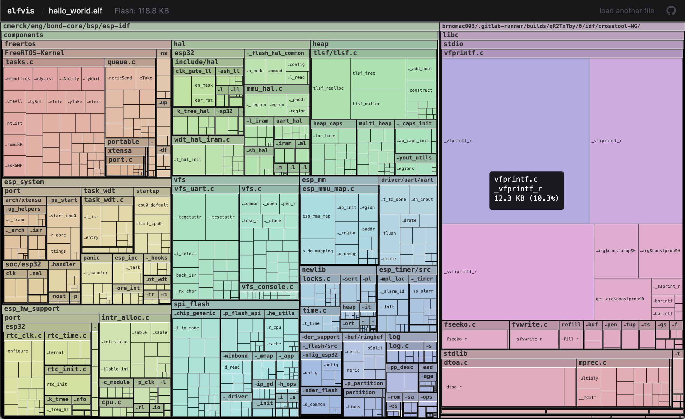

# elfvis - binary size treemap viewer

_Originally published on [Substack](https://merck.substack.com/p/elfvis-binary-size-treemap-viewer)._

**tl;dr:** i built a webpage that shows you where all the flash space in your firmware project has gone.

[Elfvis](https://bondhome.github.io/elfvis/) has entered the building:

<!-- more -->

Let's say you've run out of flash on your embedded project. Whoops. Now every time you want to add a feature, you need to squeeze out some KiB from somewhere else. The trouble is, running `nm` is such a bore and [Bloaty](https://github.com/google/bloaty) is still tricky to see the whole project at once.

So, inspired by Simon Willison's recent [remark](https://simonw.substack.com/p/agentic-engineering-patterns) about the Go ecosystem having a [Go binary visualizer](https://github.com/Zxilly/go-size-analyzer), I went and built a little binary size visualizer of my own, that you can run right from your browser.

## Usage

1. build your firmware
2. find the `.elf` file[^1]
3. go to <https://bondhome.github.io/elfvis/>
4. drag and drop the elf
5. **the elf does not leave your machine**

So far I've only tested this on STM32 and ESP32 binaries. Does not (yet) work for macOS binaries.

[^1]: be sure to build with debug symbols (`-g`)

## Learnings

Made in one morning with Claude Code / Opus 4.6, [Jesse Vincent](https://en.wikipedia.org/wiki/Jesse_Vincent)'s [superpowers](https://github.com/obra/superpowers), and copious amounts of [Stumptown](https://www.stumptowncoffee.com/).

The key steering I did was to **build entirely in Rust/WASM**, even the file upload. The frontend is just **Rust writing directly to HTML5 Canvas.** This is very performant and "Keeps It Simple Siegfried." I've never been much for frameworks, having always just preferred to go straight to Canvas, and now Rust can do it. 🤯

The coloring works by starting out with the full [hue](https://en.wikipedia.org/wiki/Hue) interval from 0°–360°. Then, each time we branch off down the file tree, we apportion the hue interval of the parent relative to the area of the subtrees. This way all the colors of the color wheel are distributed evenly across the screen.

When testing on some binaries from work, I got lots of memory in the `.rodata` section, many of which did not even have any symbols attached. To solve this, elfvis peeks into the code[^2] and tries to trace out which files reference that memory and attributes the data under that file.

It's hard to fit all the symbol and file names, so if space runs out I try to show the end of the name, because the prefixes are often already clear from the tree context. Mouse over to get details.

[^2]: Actually it uses something called [DWARF Debug Information Entries.](https://calabro.io/dwarf/die)
