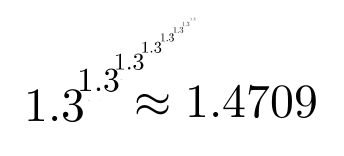
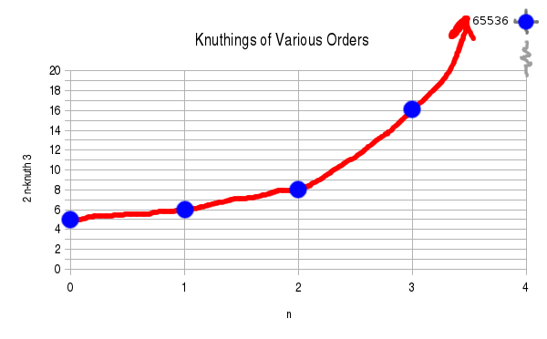

I just learned about the [Knuth up-arrow notation](https://en.wikipedia.org/wiki/Knuth%27s_up-arrow_notation) yesterday. Basically, Knuth's up-arrow is the answer to the question "What comes next in the sequence $(+, \times, \wedge)$?" You could call it iterated [exponentiation](https://en.wikipedia.org/wiki/Exponentiation). Later operators in the sequence are called "higher-order", and may be defined in terms of the previous order function.

<!-- more -->

A while back a friend and I successfully extended derivatives and integrals to [fractional orders](https://en.wikipedia.org/wiki/Fractional_calculus) for Fourier decomposable functions. (I wrote up the story in the first two pages of [this document (PDF)](../../assets/knuth-operator.pdf).) Brandon (the friend) went on to extend derivatives to complex orders. So, when I saw the Knuth operator, the first thing that came to mind was, what about fractional orders? This is like asking "what comes *between* $+$ and $\times$?"

*1.3 three-knuthed to the infinite power --- despite infinite exponentiation, the result remains finite.*

I more clearly laid out what the Knuth operator is in an attachment [Knuth Operator (PDF)](../../assets/knuth-operator.pdf). What it would mean to extend the operator to non-natural orders is itself a nontrivial question, but that's part of the fun in finding the answer!

*Plot of $2 \uparrow^n 3$ for $n = 0, 1, 2, 3, 4$. The blue dots show integer-order values; the smooth curve is a conjectured extension to fractional orders.*

Finding some elegant extension to fractional orders would be quite satisfying. The challenge is that defining non-natural order operations itself presents significant mathematical complexity.

*Originally published on [Quasiphysics](https://quasiphysics.wordpress.com/2011/12/18/extending-the-knuth-operator/).*
