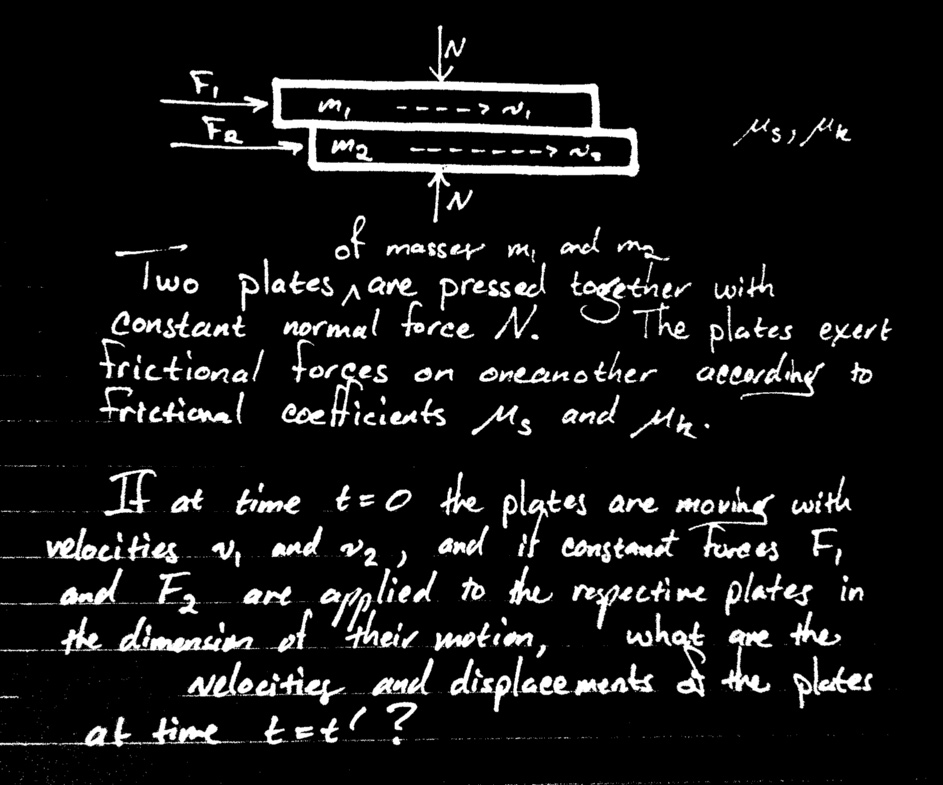

This rather simple physics problem is at the heart of any simulation involving rubbing parts.

<!-- more -->

I'm working on a realistic driving simulation which requires accurate [friction](https://en.wikipedia.org/wiki/Friction) calculations. The clutch, transmission synchros, and wheels must be simulated as frictional systems. The clutch and synchros require an angular version of the problem above, and the wheels require a two-dimensional version, but these extensions are simple. I have spent some time on this problem, and still do not have a satisfactory numerical implementation. At first I thought I had been out of school too long, but then I found [this paper](http://math.uhcl.edu/shiau/Paper/MotionI.pdf). Apparently even the simplest case of [dry friction](https://en.wikipedia.org/wiki/Friction#Dry_friction) between two plates represents a challenge for NASA applied mathematicians!

Although I lack a completely satisfactory implementation, I've gotten close enough for a demonstration. Check out the video of the drivetrain part of the driving simulation.

Currently the sound made while braking is totally fake, considering that the wheels are not allowed to slip against the pavement. A future version of the driving simulation will include motion into the second dimension, and wheel slippage. Then you can practice braking the wheels loose, [countersteering](https://en.wikipedia.org/wiki/Countersteering) in a slide, and other fun things. More in an upcoming post.

---

*Originally published on [Quasiphysics](https://quasiphysics.wordpress.com/2010/12/05/friction-problem-and-drivetrain-simulation/).*
