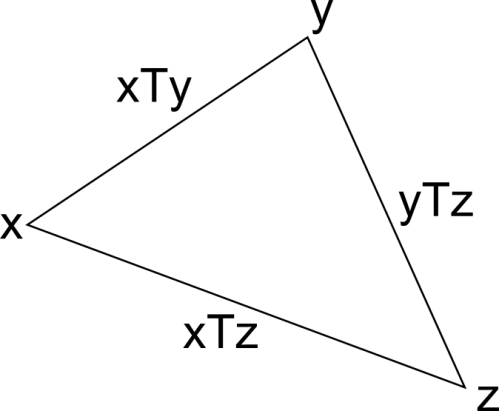
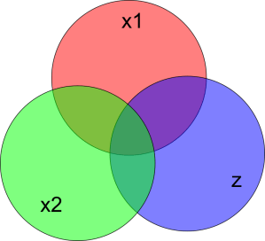

Last year I had the opportunity to travel to Sweden for a week. Finding out a few weeks ahead of time, I started studying Swedish. By the time I flew there, I had studied less than 9 hours total. However, I found that I was able to understand a great deal, and even communicate with people in basic situations. I will give a few examples, with translations in German and English for comparison.

<!-- more -->

I was comfortable with the basic greetings:

*Swedish: God morgon. Hur aer det med dig idag?*

German: Guten Morgen. Wie geht's dir heute?

English: Good Morning. How are you today?

I could also engage in some basic communication, like when I asked a man on the plane if he would like to exchange seats so he could sit next to his wife:

*Swedish: Ursaekta, vill du sitta med din fru?*

German: Entschuldigung, willst du mit deiner Frau sitzen?

English: Excuse me, do you want to sit with your wife?

Also, I found that I could very quickly learn new vocab just from seeing it in the environment; for example, on the train there was a scrolling marquee which used the verb "stiga av". From this I was able to ask the woman who was sitting by the window next to me if she was getting off:

*Swedish: Stiger du av?*

German: Steigst du aus?

English: Are you getting off?

Why was it so easy for me to pick up Swedish? It is partially because Swedish grammar is intrinsically simple, but mostly because Swedish shares most of its [lexicon](https://en.wikipedia.org/wiki/Lexicon) and grammatical principles with either English and/or German. Seeing as I have a strong background in both languages, my learning of Swedish was greatly accelerated.

This experience got me thinking about the [language acquisition](https://en.wikipedia.org/wiki/Language_acquisition) phenomenon. There is much to wonder and to learn about this complicated process, but, in this post, I'm concerned only with the problem of the amount of time required to learn one language given fluency in another language or some number of other languages. I will take a mathematical approach, highlighting, as I normally do, where I think deeper study would be worthwhile.

Lastly, I should point out that I am fully aware that language learning is a complex, learner-specific, and beautiful process that cannot just be bottled up in a mathematical theory. I make no claim that the theory suggested here even has any benefit to the field of linguistics. These are simply my thoughts that have been inspired by the language learning process.

## The L2 Acquisition Time Relation

Note: I use the $L_n$ notation from linguistics. $L_n$ means the $n$th language learned. So $L_1$ is the native language, $L_2$ the second language, $L_3$ the third, and so on.

Let's denote languages by lowercase Latin letters, $x$, $y$, $z$, for example. Also, let $T$ be a relationship between languages giving the time it takes to learn one language given knowledge of some other language. So, $xTy$ is the number of hours required to learn a language $y$ given that the language $x$ is known. I call $T$ the L2 acquisition time, because it describes the time required for a person to learn a second language.

The next logical step in our thinking is to try to understand the structure of the $T$ relation. The first structural feature that is apparent to me is the [triangle inequality](https://en.wikipedia.org/wiki/Triangle_inequality), which algebraically means that we have an upper bound on $xTz$ of $xTy + yTz$ for any $y$:

$$\forall x, z, y: \quad xTz \leq xTy + yTz$$

That is, say you're fluent in a language $x$ and you wish to learn a language $z$. You could learn the language $y$ requiring a time $xTy$, and once you've learned $y$ to the point of fluency you move on to learning language $z$ which in turn requires at most $yTz$ hours. Of course, it is probably more efficient to learn $z$ directly from $x$, requiring only $xTz$ hours.

This triangle inequality is a characteristic shared by most notions of distance between abstract objects. If we want to think of $T$ as a [distance function](https://en.wikipedia.org/wiki/Metric_(mathematics)) for languages however, it should have at least one other property: symmetry.

So now we ask whether $T$ is symmetric. That is, whether $\forall x, y: xTy = yTx$.

One could argue that to learn English from French is more difficult than to learn French from English; because the English language has a lexicon which is a fusion of the [Germanic](https://en.wikipedia.org/wiki/Germanic_languages) and [Romance](https://en.wikipedia.org/wiki/Romance_languages) lexicons, whereas French has (for the most part) only Romance vocabulary. So, when you approach French from English, you already have most of the vocabulary in your arsenal, but when you approach English from French you will have to learn the Germanic half of the English lexicon without the benefit of French [cognates](https://en.wikipedia.org/wiki/Cognate). However, for the time being, I will assume $T$ to be symmetric.

## L3+ Acquisition

A third point to address, and the most difficult one, is the question of the time required to learn a language given knowledge of multiple languages. So, to take a real-life example, say an English speaker wants to learn Swedish. Suppose that $(\text{English})T(\text{Swedish}) = 100\text{h}$, and that $(\text{German})T(\text{Swedish}) = 100\text{h}$. That is, it takes at most 100h for someone fluent in English to become fluent in Swedish, and it takes at most 100h for someone fluent in German to become fluent in Swedish. But what about the case of someone who is fluent in both English and German? I would point out from personal experience that you can make progress in Swedish very quickly if you have a strong background in *both* English *and* German. So we should have some way to form an upper bound, a "$T$", for learning Swedish given knowledge of both English and German.

Moving back to algebraic notation, say we have a target language $z$ and languages $x_1$ and $x_2$ which are known to the point of fluency. Say that $x_1 T x_2$ is small, say 1, and $x_1 T z$ and $x_2 T z$ are both 100h. This means that $x_1$ and $x_2$ are just dialects of the same language. I feel that knowing $x_2$ in addition to $x_1$ doesn't help too much in reducing the time required to learn $z$. How can we formalize this? We could take the opposite extreme, where we have two known languages that are as distant as the triangle inequality will allow. So if we stick with $x_1 T z = x_2 T z = 100\text{h}$, then $x_1 T x_2$ can be at most 200h. In this case, I would believe that someone who knows $x_1$ and $x_2$ would find $z$ very easy. Would it cut the time in half? Would $\{x_1, x_2\}Tz = 0$?

## Micromodel of Language Learning

At this point, I don't see the abstract $T$ formalism helping us any more. We need a model of the underlying language learning mechanics in order to proceed further. A simple model could represent languages by their lexicons, that is, sets of words. Let's use the same lowercase Latin letters to denote the representations of languages.

Then the intrinsic difficulty of a language $x$ is $|x|$, and the commonality between two languages may be written $|x \cap y|$.

So, the "distance" to $y$ given $x$ is simply the number of new words to be learned in $y$:

$$xTy = |y - x|$$

The triangle inequality is immediately satisfied. If we want symmetry though, we must assume that the intrinsic difficulties of all languages are the same, that is, that they all have the same size lexicon:

$$\forall x: |x| = N$$

With or without symmetry, we can easily write the L3 acquisition time:

$$\{x_1, x_2\}Tz = (x_1 \cup x_2)Tz = |z - (x_1 \cup x_2)|$$

which obviously extends to arbitrarily many known languages.

This model is rough, but it may be enough to do some simple experiments and make basic predictions. It would be fascinating to develop a more sophisticated model that takes our neuroscience and psychological understanding of the process into account.

## Experimentation

Lastly, I would like to gather some experimental data to give this project an empirical basis. The [US Foreign Service Institute](https://en.wikipedia.org/wiki/Foreign_Service_Institute) has apparently collected data on how long it takes US trainees to learn various foreign languages. This data could be used as a starting point, but we will need information on the L2 acquisition times with languages other than English as the known starting language. With this data in hand, I'd like to see how well the above model and speculation holds up.

---

*Originally published on [Quasiphysics](https://quasiphysics.wordpress.com/2011/04/18/language-acquisition-times/).*
