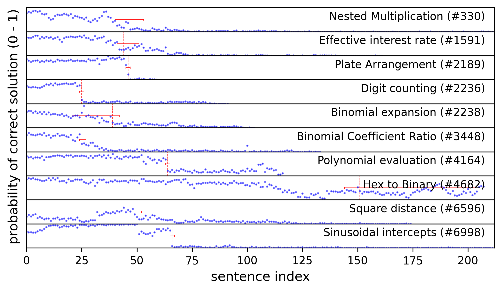

# Locating Reasoning Errors with Active Sampling

_Chris Merck (chrismerck@gmail.com) -- 2nd North East Mechanistic Interpretability Workshop, August 22, 2025, Northeastern University, Boston_

---

## Abstract

Recent advances in chain-of-thought reasoning allow large language models (LLMs) to solve mathematical problems that are beyond the computational power of a single forward pass. This suggests the existence of learned mechanisms operating at the level of reasoning steps in the chain of thought (CoT), yet few techniques exist for identifying these mechanisms. Furthermore, chains of thought can be deceptively interpretable, resembling human internal monologues closely enough that we risk being misled about their causal structure, heightening the need for rigorous interpretability methods. In this work in progress, we develop an algorithm for locating reasoning errors in incorrect base solutions via targeted resampling. This exploration should improve our understanding of chain-of-thought reasoning, particularly how it goes wrong, allowing us to more safely and efficiently operate reasoning models.

## Introduction

One frame through which to interpret reasoning traces is to treat them as the work of a math student, with the researcher as tutor. Correct answers to unguessable problems may be rewarded without inspecting the work, while the incorrect solutions are more interesting: the tutor scans for the first mistake and circles in red pen, leaving a helpful comment. We aim ultimately to automate this process, with this poster presenting some of the elements of work in progress. We see this work as part of a broad effort to take advantage of the present opportunity for CoT monitoring and interpretability (Korbak et al., 2025) and an application of counterfactual techniques from physical systems (Merck & Kleinberg, 2016).

**Foundational Work.** In their recent groundbreaking preprint, Bogdan et al. (2025) employ several techniques for finding causal structure among the sentences of a CoT reasoning trace, cross-validating counterfactual sampling against attention tracing and masking. They develop the `math-rollouts` dataset, containing 10 incorrect base solutions to problems from the MATH dataset as generated by DeepSeek R1-Distill Qwen-14B (DeepSeek, 2025), selected for intermediate difficulty (having between a 25% and 75% probability of being solved correctly). The dataset also contains 100 rollouts for each sentence in each reasoning trace, allowing us to explore the probability trajectory and counterfactual scenarios.

## Active Bayesian Changepoint Detection

Although `math-rollouts` provides a useful starting point, we would like to eventually scale up to using state-of-the-art reasoning models where exhaustively generating many rollouts for each sentence would be prohibitively expensive. So we apply an active sampling algorithm to efficiently find the sentence containing the most prominent error, termed a *changepoint* after Adams & MacKay (2007), resulting in a ~100X reduction in the number of rollouts required, at least when the trace contains a clear error.

We propose a Bernoulli process model with a single changepoint τ at which the probability of a correct solution drops from p₁ to p₂:

$$
p(\text{correct}_t) = \begin{cases}
p_1 & \text{if } t < \tau \\
p_2 & \text{if } t \geq \tau
\end{cases}
$$

**Bayesian Inference.** We maintain a posterior distribution over changepoint locations τ ∈ {1, …, T} using a uniform prior. For each hypothesis τ, we model the probabilities with Beta priors: p₁ ~ Beta(2, 2), reflecting our belief that the initial probability lies between approximately 25% and 75%, and p₂ ~ Beta(1, 19), a strong prior on a low chance of recovery.

**Active Sampling.** We select the next sample location with replacement to maximize expected information gain about the changepoint location:

$$
t^* = \arg\max_{t} \mathbb{E}_{y_t}[H(\tau) - H(\tau | y_t)]
$$

where H(τ) is the entropy of the current posterior over changepoint locations and y_t ∈ {0, 1} is the correctness of the hypothetical resampled rollout. This strategy efficiently focuses sampling around the uncertain changepoint region.

**Probability Trajectories.** With the choice of a strong prior on p₂, we find that the algorithm tends to find reasonable changepoints with just 100 rollouts.

## Failure Analysis

We now examine and discuss selected failures based on the change in answer distribution at the changepoint and a reading of the trace.

!!! failure "Nested Multiplication (#330) — *wrong base case in recurrence relation*"
    Wait, wait, no. 
    Let me think. 
    **Wait, in the original expression, each time it's 3*(1 + ...). So, actually, each level is 3*(1 + previous level).** So, maybe I should approach it as a recursive computation.

The trace was on the right track—only two computations away from the correct answer. But when the model used the ellipsis (`...`), many rollouts failed to converge to a boxed answer, recursing until the token limit. The base solution does converge, and fails due to an error in the base case of 4 instead of 0 or 12. Although visually the probability trajectory does seem to contain a clear changepoint, the identified sentence is in fact by inspection the first introduction of this mistake that persists into the incorrect solution.

Now we examine the starkest failure in the Digit Counting problem:

!!! failure "Digit Counting (#2236) — *non sequitur*"
    The ones digits here are 1–8, so 4 **doesn't** appear in the units place in this partial set.

Here the model makes a statement that is obviously false to us, but is generated with approximately a 25% probability at this step. To better understand the structure of this failure, we collect all 100 rollouts resampled at this changepoint sentence and visualize them in a dendrogram. Following Bogdan et al. (2025), we join rollouts if the sentence embeddings have cosine similarity greater than the median similarity between all sentence pairs (0.8).

Finally, we examine a case where there is no clear changepoint. Inspecting the the model's solution summary, we find that the model was quite knowingly vacillating between two possible interpretations of the problem:

!!! warning "Hex to Binary (#4682) — *trick question*"
    While converting each hexadecimal digit to 4 bits results in a 20-bit binary number, the minimal number of bits required to represent the number 419,430₁₀ without leading zeros is 19.
    
    However, since the problem asks for the number of bits when the hexadecimal number is written in binary, and **considering that each hexadecimal digit is typically converted to 4 bits**, the correct answer is 20 bits.

## Limitations and Future Directions

- Although we prefer to investigate reasoning errors in a counterfactual context, there is a body of existing work that studies errors in chain-of-thought prompting within and beyond mathematical reasoning (Lightman et al., 2023; Tyen et al., 2024), which also examines reasoning structure beyond the influence on accuracy (Xia et al., 2025).

- As we saw with the trick question, the failure of these models to deliver mundane utility often stems from issues interpreting the user's prompt rather than logical errors within the chain of thought. The relationship of user intent and model interpretation can be fully formalized (Wu et al., 2022) for mathematical problems. The broader problem of prompt interpretation is of high importance to alignment, especially as models become capable of achieving more work with a single operator instruction.

- The rollouts in `math-rollouts` are drawn from a relatively small 14B model distilled from a larger one (DeepSeek R1 671B). It is possible that reasoning failures in stronger models are qualitatively different, or that the structure of the reasoning behavior differs after distillation. The changepoint detector introduced here is intended to facilitate testing on larger models.

- The changepoint model assumes a single error. However, realistic chains of thought may contain multiple errors and backtracking leading to a more complex probability trajectory. It is possible to develop a changepoint detector for these more complex structures, but validation requires much more than the 10 examples available in the `math-rollouts` dataset.

- In particular, the case of no clear changepoint is important to avoid spurious error detections. The algorithm could be updated to track confidence in a null hypothesis.

- State-of-the-art reasoning models and agents use parallel execution and subagents (subroutines with chains of thought that are not fully attended to by the top-level agent such as in Anthropic, 2025). Investigating failure modes of these new architechtures is a challenge due to their complexity, however it would appear that the Bogdan et al. (2025) methods could be adapted. Active sampling may be of even greater importance as the compute per rollout increases.

## Acknowledgements

I am grateful for discussions of this work with Anuj Apte. This work is generously supported by a grant from the Cosmos Institute (<https://cosmos-institute.org/>) and the Foundation for Individual Rights and Expression (FIRE) (<https://www.thefire.org/>).

## References

- Adams, R. P., & MacKay, D. J. (2007). Bayesian online changepoint detection. arXiv preprint arXiv:0710.3742.
- Anthropic (2025). Claude 3.5 Sonnet with Computer Use. Available at: https://www.anthropic.com/
- Bogdan, P., et al. (2025). Thought Experiments: Counterfactual Reasoning in Chain-of-Thought. arXiv preprint.
- DeepSeek (2025). DeepSeek R1: Reasoning at the Edge of AGI. arXiv preprint.
- Korbak, T., et al. (2025). Chain-of-thought reasoning as a monitoring opportunity. arXiv preprint.
- Lightman, H., et al. (2023). Let's verify step by step. arXiv preprint.
- Merck, C., & Kleinberg, S. (2016). Causal explanation under indeterminacy: A sampling approach. In Proceedings of the AAAI Conference on Artificial Intelligence.
- Tyen, G., et al. (2024). LLMs cannot correct reasoning errors yet. arXiv preprint.
- Wu, Y., et al. (2022). Autoformalization with large language models. arXiv preprint.
- Xia, M., Li, X., Liu, F., Wu, B., & Liu, P. (2025). Reasoning structure in chain-of-thought beyond accuracy. arXiv preprint.
