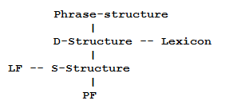

As is the case in the physical sciences, I believe that linguistics proceeds in a pattern of [punctuated equilibrium](https://en.wikipedia.org/wiki/Punctuated_equilibrium), those punctuations being [paradigm shifts](https://en.wikipedia.org/wiki/Paradigm_shift) whereby the foundations of accepted theory are rewritten. In this manner, old mysteries transform into solvable puzzles, explanations become more elegant, and new technological advances become possible. My proposition is that generative linguistics should be reformulated in terms of quantitative neuroscience, and that such a reformulation would prove highly productive.

<!-- more -->

The most notable recent paradigm shift in linguistics stems from the advent of the generative tradition, spearheaded by [Noam Chomsky](https://en.wikipedia.org/wiki/Noam_Chomsky). Rather than accepting [Saussure](https://en.wikipedia.org/wiki/Ferdinand_de_Saussure)'s descriptive approach to grammar, Chomsky introduced [transformational rules](https://en.wikipedia.org/wiki/Transformational_grammar) that build grammatical utterances systematically. Early generative theorists cautioned against interpreting theoretical constructs as literally existing in speakers' minds. However, since the 1960s, linguists have increasingly addressed implementation questions. Chomsky's [Universal Grammar](https://en.wikipedia.org/wiki/Universal_grammar) exemplifies this shift: syntacticians argue that "[poverty of the stimulus](https://en.wikipedia.org/wiki/Poverty_of_the_stimulus)" evidence necessitates innate grammatical capacity.

Consider the following block diagram of [Government-Binding Theory](https://en.wikipedia.org/wiki/Government_and_binding_theory) showing syntax's discrete representational levels:

Lexical items are inserted from the lexicon into phrase-structures creating "deep structure," which transforms into "surface structure," then into "phonological form" and "logical form."

Recent neuroscience research on sign language users employs [hemodynamic imaging](https://en.wikipedia.org/wiki/Functional_magnetic_resonance_imaging) to examine the S-structure-PF interface, though such work lacks quantitative rigor. Vision neuroscience provides promising parallels: if researchers could map brain regions processing linguistic representations and reverse-engineer neural codes for [phonemes](https://en.wikipedia.org/wiki/Phoneme), [morphemes](https://en.wikipedia.org/wiki/Morpheme), and [theta-roles](https://en.wikipedia.org/wiki/Theta_role), linguistics would enter a revolutionary paradigm.

With such neural foundations, researchers could answer fundamental questions about meaning storage and computational language understanding. While traditional linguistics, NLP, and psychology remain important, quantitative neuroscience offers the most functionally satisfying answers to linguistics' persistent questions.

---

*Originally published on [Quasiphysics](https://quasiphysics.wordpress.com/2013/10/02/neurolinguistic-paradigm-shift/).*
