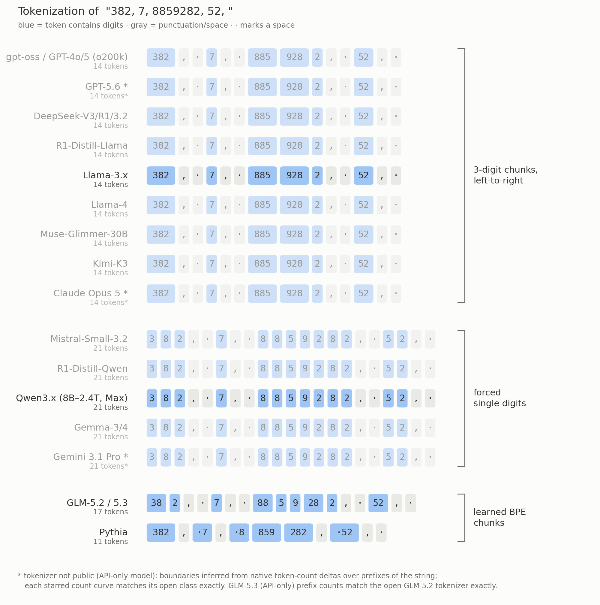

Language models can kind of do math in their heads. How does this work? Let's find out. But first, we need to understand even how do numbers get represented as they are fed into the transformer. That is, how are numbers _tokenized_?

<!-- more -->

It turns out that the frontier is currently split between three tokenization regimes: 

 - Llama3, OpenAI, Moonshot, and DeepSeek (the "big model" folks) have dedicated tokens for all 3-digit numbers
 - Qwen3, Mistral, and Gemma (the "small model" folks) use one token per digit
 - Z.ai's GLM models (shall we say the "pragmatic efficient models") use a learned tokenization that chaotically chunks numbers

At a low level, it is certainly true that the tokenizer makes a difference in how the models think: when Llama and Qwen are asked the same 3x3-digit addition problem, they need rather different mechanics: Llama represents each number as a single token and therefore a single direction in latent space, at least on the inner layers, while Qwen needs to construct an understanding of the input number digit-by-digit and then serialize the sum back digit-by-digit.

With this perspective, it's small wonder that Llama3-8B scores perfectly on 3-digit addition problems whereas Qwen3-4B-Base struggles with carries. After all, there's a reason why we learn in gradeschool to add numbers from right to left!

