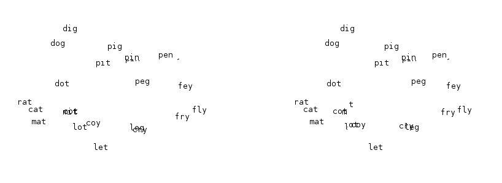

[Lewis Carroll](https://en.wikipedia.org/wiki/Lewis_Carroll) invented a word game called [Doublets](https://en.wikipedia.org/wiki/Word_ladder) (now commonly known as "word ladders") in which you transform one word into another by changing a single letter at a time, with each intermediate step being a valid word. Here I explore embedding such word relationships into three-dimensional space using a [genetic algorithm](https://en.wikipedia.org/wiki/Genetic_algorithm).

<!-- more -->

## Theory of Embedding

Consider a set of $N$ points with a distance function $\Delta_{ij}$ among them, satisfying the usual properties: non-negativity, symmetry, and the [triangle inequality](https://en.wikipedia.org/wiki/Triangle_inequality). The embedding problem asks: can we find coordinates in $\mathbb{R}^3$ that preserve these abstract distance relationships?

We measure the quality of an embedding using a weighted mean-square error function that emphasizes closely-spaced points more heavily than distant ones:

$$Q = -\sum_{ij} \frac{1}{\Delta_{ij}^2}\left(\Delta_{ij} - |x_i - x_j|\right)^2$$

## Application to Doublets

Define the word set $W$ = {pig, pin, pen, fen, fey, fly, dig, dog, dot, cot, cat, rat, mat, mit, pit, fry, cry, coy, peg, leg, let, lot}. These words form a graph where vertices are words and edges connect words differing by exactly one letter. The distance between any two words equals the shortest path length in this graph (the shortest [word ladder](https://en.wikipedia.org/wiki/Word_ladder) between them).

## Genetic Algorithm Approach

I don't want to go into the theory of GAs right now, but the basic idea is to establish a biological analogy in which potential solutions are individuals of a population. Fitter individuals reproduce more, and random mutations introduce variation. Over many generations, the population converges toward good solutions.

[Scheme](https://en.wikipedia.org/wiki/Scheme_(programming_language)) is particularly well-suited to problems of this kind. Its [functional programming](https://en.wikipedia.org/wiki/Functional_programming) paradigm means that the core GA logic can be written once as a higher-order function:

```scheme
(darwin init-pop fitness mutator)
```

Here `darwin` takes an initial population, a fitness function, and a mutation operator as arguments --- all the problem-specific details are abstracted away, making the GA code completely reusable.

## Results

The algorithm was run on the three-letter word set defined above. The screenshot below shows a partially-optimized embedding where spatially nearby words are indeed close in word-ladder distance:



---

*Originally published on [Quasiphysics](https://quasiphysics.wordpress.com/2010/12/05/playing-genetic-doublets/).*
