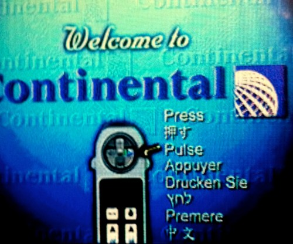

Can you see what's wrong with this picture?

<!-- more -->

The English-speaking world often points out hilariously incorrect English on signage created by Easterners. The last time I was on a Continental flight I cracked a smile over the opposite sort of mistake:

I noticed that their Chinese translation for "Press" on their welcome screen is quite wrong.... 中文 means "Chinese" in the sense of the [Chinese language](https://en.wikipedia.org/wiki/Chinese_language). I suppose that whoever was responsible for this welcome screen just put that in as a place-holder and forgot to get a translation. The Japanese on the other hand looks better; although I can't vouch for it, at least it has the [radical](https://en.wikipedia.org/wiki/Radical_(Chinese_characters)) for "hand" in it!

---

*Originally published on [Quasiphysics](https://quasiphysics.wordpress.com/2011/02/27/press-is-chinese-language/).*
