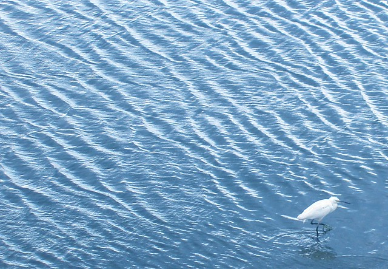

Ever since doing research on [sunglint](https://en.wikipedia.org/wiki/Sunglint) at the Stevens' Light and Life Lab I've been fascinated by the simplest thing: wavy water surfaces. A favorite summertime activity of mine is to sit by a lake and watch the waves on the water's surface. Now, different people of different backgrounds and inclinations may see different things when they look at the water. I will explain here what I see, how I see it, and what thoughts the sight kindles for me.

<!-- more -->

When I first look at the waves, I see a main set of waves. These waves have a particular shape and frequency and they translate across the water surface at a particular velocity. The eye has a wonderful ability to "lock on" to a moving pattern, and I use this ability to keep my eye on the same wave as it progresses through space. Judicious application of this technique will lead the waterwatcher to notice some subtle but fascinating features and effects which are not at first apparent. I'll list those effects that I've found particularly interesting:

**Feature lifetime, or morphing of ripple patterns:** If you lock your gaze onto a particular wave, and try to follow it as it glides along the surface, you will notice that the wave has a finite lifetime! For smaller waves, any given wave crest seems only to last for about a second before it disappears. However, the wave that you were watching is part of a pattern of waves. That pattern is persistent, or at least has a much longer lifetime. It is more difficult to lock your eye onto a whole ripple pattern, due to the morphing of the constituent features, but it can still be done, thus demonstrating (or at least convincing me) that the ripple pattern (or [wave group](https://en.wikipedia.org/wiki/Wave_group), or whatever you want to call it) is a worthwhile entity to discuss, the individual wave features themselves being too transient to be useful objects of discussion at this point. I use the terminology *ripple pattern* because it is less formal, and I don't want to imply that I'm talking about some formalized concept.

**Superposition of ripple patterns:** After locking your gaze onto the main ripple pattern, you will notice that not all of the features on the water's surface belong to that pattern you've been following. In fact, you can lock your eye onto other patterns, which have distinct features and move across the surface with a different velocity. Sitting by my lake, I've been able to lock onto four ripple patterns one at a time (obviously not at once!). In the photo below, you get the impression that there are at least two simultaneous ripple patterns, despite the limitation of this being a still photo. This [superposition](https://en.wikipedia.org/wiki/Superposition_principle) of multiple ripple pattern components to form the whole of the surface features is what fascinates me the most.

**Reflections:** When waves strike against an obstacle posed in the water, waves reflect off of that obstacle back into the open water. You can see reflections off of the legs of the egret in the photo below. I wonder if the reflections are distorted versions of the ripple patterns which caused them, or if they are generated anew.

*Photo credit: Shikeroku of Flickr, used by permission*

## In Search of an Algorithm

I'm now in the process of working out the math for an algorithm which can detect and extract ripple patterns given the surface height over time. Here I'll just lay down the formal setup that I'm starting with and in a later post I will give the results of my doodling.

So I take as given the observed surface heights over time, which are packed into a function:

$$\varphi(\mathbf{x}; t) = \text{surface height at position } \mathbf{x} \text{ at time } t$$

(I like to keep the notation simple by just writing $\mathbf{x}$ when I mean a vector consisting of a longitudinal and a latitudinal component.)

What I would like is an algorithm to take the surface heights and return a set of ripple patterns (a yet-to-be-formalized concept). Given the morphing of ripple patterns, this is a rather ill-defined task. To make matters more concrete, we could say that I'm looking for a decomposition of the surface height timeseries $\varphi$ into a [phase-space](https://en.wikipedia.org/wiki/Phase_space) density valid at and near a particular time for a particular region of the surface, with some restrictions on the complexity of that density. I write this phase-space density as follows:

$$\rho(\mathbf{x}, \mathbf{v}) = \text{density of wave height at } \mathbf{x} \text{ with velocity } \mathbf{v}$$

(This notation I borrow from my experimentation with the collision-free [Boltzmann equation](https://en.wikipedia.org/wiki/Boltzmann_equation) which is useful for modeling non-colliding distributions of matter under self-gravitation such as galaxies.)

Alternatively, and more simply, we could say I'm looking for an algorithm that takes the surface height timeseries, or perhaps just the surface heights at an instant in time plus one or two time-derivatives, and returns a set of surface functions paired with velocities which, when summed together with the velocities taken into account, approximates the observed surface heights and the changes undergone by those heights within a window of time. Symbolically, the output of the algorithm would look like:

$$\{(\varphi_0, \mathbf{v}_0), (\varphi_1, \mathbf{v}_1), \ldots\}$$

And then we could sum these components together to obtain an approximation of the original (measured) surface timeseries:

$$\varphi(\mathbf{x}, t) \approx \sum_i \varphi_i(\mathbf{x} - \mathbf{v}_i t)$$

## Experiment

I have long intended to gather wavy water surface data electronically and to analyze it in various ways. I have some data from the sunglint project which may be of use. Anyhow, I am now particularly interested in designing, implementing, and then testing a ripple pattern detection algorithm as outlined above. The results may come in a later post.

---

*Originally published on [Quasiphysics](https://quasiphysics.wordpress.com/2011/04/04/ripple-component-recognition/).*
