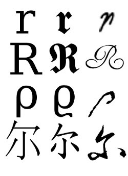
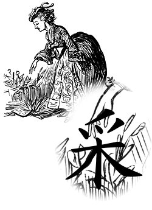

While taking notes for [ai-class](https://en.wikipedia.org/wiki/Introduction_to_Artificial_Intelligence_(course)), I found myself in a conundrum that any amateur mathematician can relate to: I ran out of appropriate letters in the Roman and Greek alphabets.

<!-- more -->

[Sinograms](https://en.wikipedia.org/wiki/Chinese_characters) (Chinese characters) present a vast and largely untapped source of mathematical notation. They can be used both phonetically and semantically, much as [aleph](https://en.wikipedia.org/wiki/Aleph_number) ($\aleph$) is borrowed from Hebrew in set theory.

## Phonetic Use: 尔 for 'r'

An example of a phonetic use is when I needed an 'r'-like letter for the sum of rewards to an agent: we were already using upper- and lower-case 'r', and the Greek version, $\rho$, just seemed inappropriate. So, I used the sinogram '尔', which is pronounced something like the English letter 'r'.

*Comparison of serif, German, and handwritten forms of 'r' in Roman script; $\rho$ variants in Greek; and Ming, kai, and caoshu versions of 尔.*

The character 尔 is easy to write, especially in cursive.

## Semantic Use: 采 for Sampling

Another example is that I needed a symbol for the stochastic procedure of picking a value from a [probability distribution](https://en.wikipedia.org/wiki/Probability_distribution). I switched to using the sinogram '采'. Although the pronunciation (pinyin: 'cai') is unrelated, the character's meaning is 'to pick' or 'to pluck' as in 'to pick flowers'. Therefore, when I want to say "pluck an element from the distribution $P$, call it $x$", I simply write:

$$x := \text{采}(P)$$

*The character 采 depicts a hand plucking a flower.*

## Greek Letters in Chinese

For reference, here are the [Greek letters](https://en.wikipedia.org/wiki/Greek_alphabet) transcribed into Chinese:

| Letter | Chinese |
|--------|---------|
| alpha | 阿尔法 |
| beta | 贝塔 |
| gamma | 伽马 |
| delta | 德尔塔 |
| epsilon | 伊普西龙 |
| zeta | 泽塔 |
| eta | 艾塔 |
| theta | 西塔 |
| iota | 约塔 |
| kappa | 卡帕 |
| lambda | 兰姆达 |
| mu | 缪 |
| nu | 纽 |
| xi | 克西 |
| omicron | 奥密可戎 |
| pi | 派 |
| rho | 肉 |
| sigma | 西格马 |
| tau | 套 |
| upsilon | 衣普西隆 |
| phi | 斐 |
| chi | 喜 |
| psi | 普西 |
| omega | 欧米伽 |

## Traditional Character Sets for Mathematical Use

Chinese also offers several historically significant ordered sequences of characters, well-suited as mathematical abbreviations:

**[Five Elements](https://en.wikipedia.org/wiki/Wuxing_(Chinese_philosophy)) (五行):** 木 火 土 金 水 (tree, fire, earth, metal, water)

**[Twelve Earthly Branches](https://en.wikipedia.org/wiki/Earthly_Branches) (地支):** 子 丑 寅 卯 辰 巳 午 未 申 酉 戌 亥

**[Ten Celestial Stems](https://en.wikipedia.org/wiki/Heavenly_Stems) (天干):** 甲 乙 丙 丁 戊 己 庚 辛 壬 癸

These are often used as ordinals in everyday writing and carry real historical and cultural significance in Chinese.

---

*Originally published on [Quasiphysics](https://quasiphysics.wordpress.com/2011/11/16/sinograms-in-mathematics/).*
