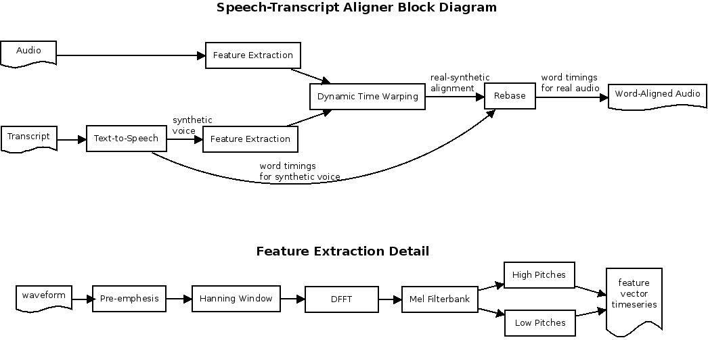
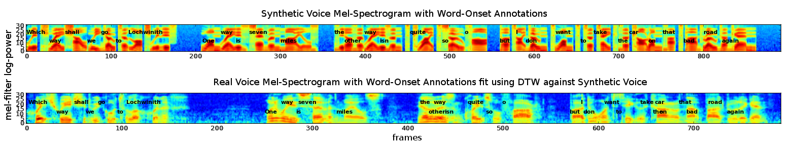
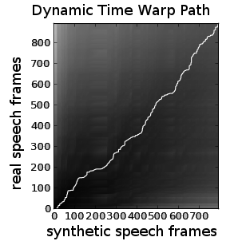

A method for aligning a transcript to recorded speech is described, motivated by the need for alignment of audiobooks for use by [SLA](https://en.wikipedia.org/wiki/Second-language_acquisition) software. A combination of [text-to-speech](https://en.wikipedia.org/wiki/Speech_synthesis) technology, [mel-spectrum](https://en.wikipedia.org/wiki/Mel_scale) feature extraction, and [dynamic time warping](https://en.wikipedia.org/wiki/Dynamic_time_warping) are employed to obtain a word-alignment for the input speech sample.

<!-- more -->

## Motivation

Several practical applications require speech-to-transcript alignment, including synchronizing lecture videos with transcripts for subtitle generation. Here we focus on a more technically approachable problem: the alignment of audiobooks with the original text. The goal is to support language learning software that enables users to navigate audiobooks through on-screen text interaction.

## Procedure

*Block diagram of the alignment procedure.*

### Step 1: Text-to-Speech Processing

The transcript is run through [eSpeak](http://espeak.sourceforge.net/), a free, open-source text-to-speech program. This generates synthetic audio along with metadata containing word timing information, stored in JSON format.

### Step 2: Feature Extraction

Both real and synthetic audio undergo processing similar to standard [MFCC](https://en.wikipedia.org/wiki/Mel-frequency_cepstrum) analysis. We apply a pre-emphasis filter to the entire waveform, then break the waveform into frames by applying a 25ms [Hanning window](https://en.wikipedia.org/wiki/Hann_function) every 10ms. A [DFFT](https://en.wikipedia.org/wiki/Discrete_Fourier_transform) converts frames to the frequency domain, and a 32-element [Mel filterbank](https://en.wikipedia.org/wiki/Mel_scale) converts to mel-space.

Feature extraction produces two scalar timeseries from each audio stream: "high pitches" (capturing [sibilant](https://en.wikipedia.org/wiki/Sibilant) phones) and "low pitches" (capturing voiced phones).

### Step 3: Dynamic Time Warping

The [mlpy DTW implementation](http://mlpy.sourceforge.net/docs/3.5/dtw.html) aligns the feature timeseries. The "low pitches" feature was selected for best performance.

### Step 4: Word Timing Rebase

The frame alignment from DTW is used to rebase the synthetic voice word timings into the real voice time domain.

## Results

**Test audio:** A Scottish male speaker reading: "Which way shall we go to Lochwinnoch? One way is seven miles, the other way isn't quite so far, but I don't want to take the car on that bad road again."

*Resulting word-alignment displayed as annotated spectrogram. Accuracy appears good, however greater precision could be obtained with additional features.*

*Dynamic time warp path for alignment of real speech features to those of the synthetic speech.*

## Analysis

The results demonstrate overall accurate alignment. Greater precision could be obtained if additional features (such as "high pitches") are allowed into the DTW alignment step, requiring a multi-element DTW implementation.

## Future Work

Planned extensions include:

- Implementing multi-element feature vector support in DTW
- Aligning audiobooks in multiple languages (potentially [Grimms' Fairy Tales](http://www.grimmstories.com/))
- Creating aligned speech-text pairs across language translations
- Developing SLA applications for phrase translation exploration

---

*Originally published on [Quasiphysics](https://quasiphysics.wordpress.com/2013/08/08/speech-transcript-alignment/).*
