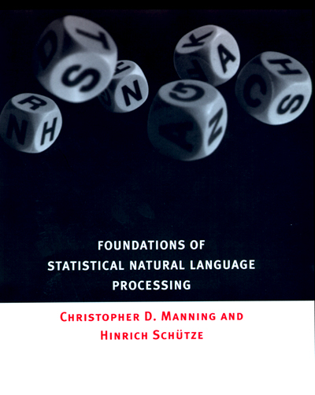
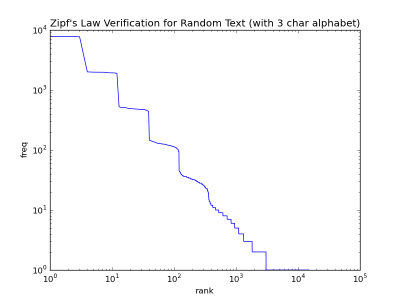

First an explication: a few weeks ago I had a revelation that computational linguistics is the field for me. So, I found the best book I could on the subject, which seems to be Manning and Schuetze's *Foundations of Statistical Natural Language Processing* (FSNLP). Just reading the introduction on Google Books was enough to convince me to drop some hard cash. The writing is brilliant. I'm only through Chapter One, but it's already worth it.

<!-- more -->

I did all the exercises to the first chapter. My solutions:

- [Chapter 1 -- Introduction (PDF)](../../assets/fsnlp-ch1-solutions.pdf)
- [Chapter 2 -- Mathematical Foundations (PDF)](../../assets/fsnlp-ch2-solutions.pdf)

Because this blog needs more pictures, here's a plot of word frequency versus rank (in terms of frequency) for randomly generated text using a three-character alphabet:

This log-log frequency-vs-rank plot shows an approximately straight line. This is a confirmation of Zipf's law, i.e., that frequency and rank are inversely related.

Hopefully I'll have the stamina to do the same for Chapters Two+...

---

*Originally published on [Quasiphysics](https://quasiphysics.wordpress.com/2011/06/30/statistical-nlp-book/).*
