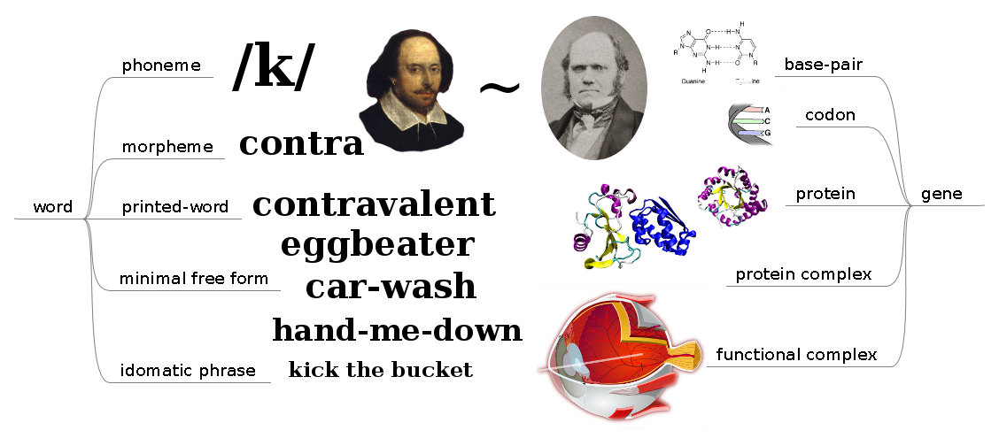
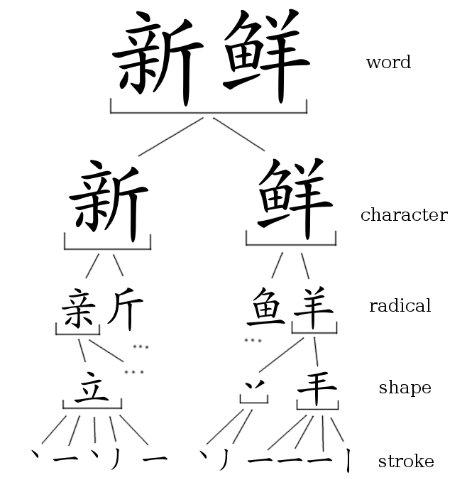

Many complex phenomena may be decomposed using a stack. For example, one might decompose contemporary scientific theory into a stack as follows: physics -- chemistry -- biology -- psychology -- sociology.

<!-- more -->

If we apply this [stack decomposition](https://en.wikipedia.org/wiki/Hierarchy) to language (from a lexical standpoint) and to biology (from a genetic standpoint) we obtain two stacks which show similarities in their structure, providing further intuitive support for the word-gene analogy of two posts back.

*Side-by-side depiction of the lexical and genetic stacks*

We also find an interesting (and perhaps even more visibly analogous) stack when we decompose [Chinese writing](https://en.wikipedia.org/wiki/Chinese_characters).

*Stack-decomposition of Chinese writing*

Stack decomposition has its weak points, of course. For one, we cannot show all the layers that exist; there are layers above and below the ones depicted (e.g., Chinese words may take part in expressions, sentences, paragraphs, books, philosophies, etc.) and it may be possible to perform a more fine decomposition. Secondly, when we perform a stack-decomposition, we are imposing an analytical angle or way-of-seeing onto the object of study; there is more than one way to skin a cat, you might say. Regardless, the stack diagrams seemed to support the word-gene analog in a visual way, and so here we are.

*Originally published on [Quasiphysics](https://quasiphysics.wordpress.com/2011/12/19/the-genetic-and-lexical-stacks/).*
