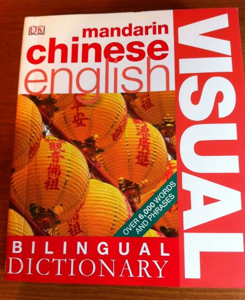
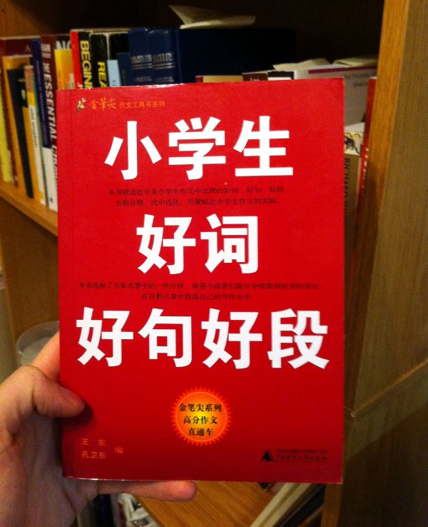

Learning vocabulary in thematic groups is an effective way to learn. However, as is often the case, it is challenging to find good learning materials. For thematic vocabulary, we want sources which simultaneously do the following:

1. contain a sufficient quantity of vocabulary in the desired fields (i.e., have both breadth and depth)
2. organize words and phrases by theme (i.e., are thematic)
3. give some example usages (i.e., provide context)

Specifically for Chinese, I've found two excellent resources thus far.

<!-- more -->

## DK's Bilingual Visual Dictionary Series

First I'll mention DK's brilliant Bilingual Visual Dictionary Series. Although they are lacking in point #3 (having no usage examples), the photography is wonderful, making the book suitable for children. I first saw these little books at a stand in Berlin, and I bought three copies on the spot. I kept a French-German and the above-pictured Chinese-English editions for myself, and gave a German-English edition to a friend of mine who is studying both German and English as second languages. These books are truly a pleasure to read. You can preview the [Mandarin-English edition on Amazon](http://www.amazon.com/Mandarin-Chinese%C3%A2-Bilingual-Dictionary-Dictionaries/dp/0756634423).

## Haoci Haoju Haoduan

A more recent acquisition of mine is *Xiaoxuesheng Haoci Haoju Haoduan* (小学生好词好句好段, Great Words, Sentences, and Paragraphs for Elementary School Students). I found it at the [World Journal Bookstore](http://www.worldjournal.com/shop_stores) in Philadelphia the other weekend. It covers a range of themes more literary and introspective than the topics covered in DK. For each topic, you get Haoci (好词, good words and phrases), Haoju (好句, example sentences applying the Haoci), and Haoduan (好段, example paragraphs on the topic). This is a fabulous way for a student of Chinese to expand their vocabulary and writing ability. The thing that sold me on the book was not only is it intended for use by Chinese natives, but, despite my low reading level, I was able to understand the preface explaining the purpose of the book and how the approach helps improve one's writing.

For example, the first major topic in the book is parts of the body. The subsection covering the hand provides the following:

- **22 two-character words pertaining to the hand.** Some obvious parts of the hand are listed, such as 手掌 'palm'. Other less obvious parts are included too, e.g. 虎口 'tiger's mouth' (i.e. the part of the hand between the thumb and index finger). There are also adjectives for describing hands, such as 笨拙 'clumsy'.

- **24 four-character [idioms](https://en.wikipedia.org/wiki/Chengyu) or idiomatic phrases related to hands**, e.g. 挥手告别 'to wave farewell', and 手舞足蹈 'to gesticulate with hands and feet', which is the equivalent of the English expression 'to dance for joy'.

- **7 sentences**

- and **5 short paragraphs**

I put together a [preview of this book (PDF)](../../assets/haoci-preview.pdf) for anyone who's interested. Despite the cute imagery, this could be a valuable asset to any intermediate student of Chinese who wants to expand their creative vocabulary.

## Automatic Themed Vocabulary List Generation

It would be nice to automatically generate a list of themed vocabulary, using some [NLP](https://en.wikipedia.org/wiki/Natural_language_processing) over a suitable corpus. Perhaps a good dictionary could be used to source words, with a similarity function defined based on similarity of definitions or web-searches of the words in question. [Clustering](https://en.wikipedia.org/wiki/Cluster_analysis) could then be applied.

Ideas?

*Originally published on [Quasiphysics](https://quasiphysics.wordpress.com/2011/11/22/thematic-chinese-vocabulary/).*
