Suppose there is a stochastic natural process $F$ which maps values from some input space $X$ to an output space $Y$. Suppose that we have observed the result of the application of this process to some finite number of known inputs. We denote the $i$th observed input-output pair, or *training example*, by $(x_i, y_i)$. We denote the set of training data by $T$. The task of a [regression](https://en.wikipedia.org/wiki/Regression_analysis) algorithm is to find (or, *learn*) an approximation to the natural process $F$. This approximation is a non-stochastic function $f$ mapping $X$ to $Y$.

<!-- more -->

In [KNN regression](https://en.wikipedia.org/wiki/K-nearest_neighbors_algorithm), for some integer $k$, for a test input $x$, we let $f(x)$ be the mean of the outputs of the $k$-nearest training examples, where the distance between the test point and training example is a [Euclidean distance](https://en.wikipedia.org/wiki/Euclidean_distance) between the test point and the input portion of the training example. Symbolically, KNN regression takes

$$f(x) = \frac{1}{k} \sum_{i \in N_k[T](x)} y_i$$

where $N_k[T](x)$ is the set of the indices of the K-nearest neighbors to $x$ given the training examples $T$.

(Other distance functions than Euclidean can be employed.)

## Visualizing the Regression

Let $X$ be the set of pixel coordinates in a 500-by-500 pixel image, and let $Y$ be an RGB color value. Assume that 15 training examples are given as in the following figure:

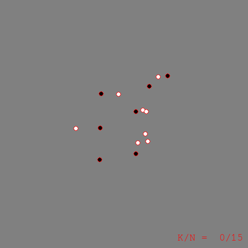

Now we can run KNN regression using some different values for $k$. The following figures visually depict the learned regression function $f$ by plotting the color $f(x)$ for each point $x$ in the image:

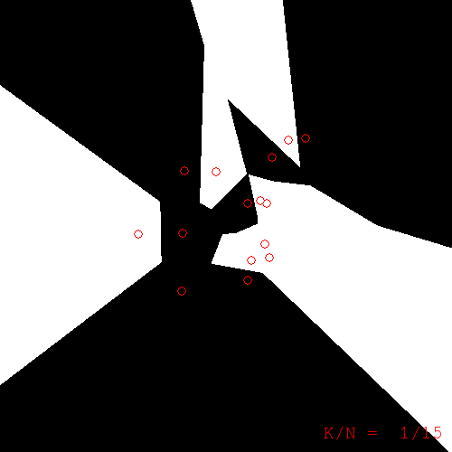

*k=1. Note: the color of a pixel is the color of the nearest training example to that pixel. Training examples are superimposed with red borders.*

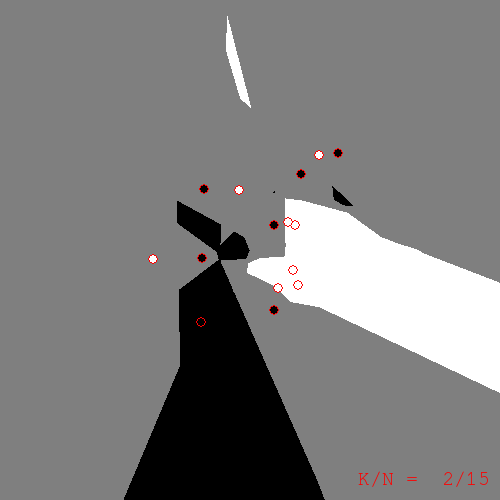

*k=2*

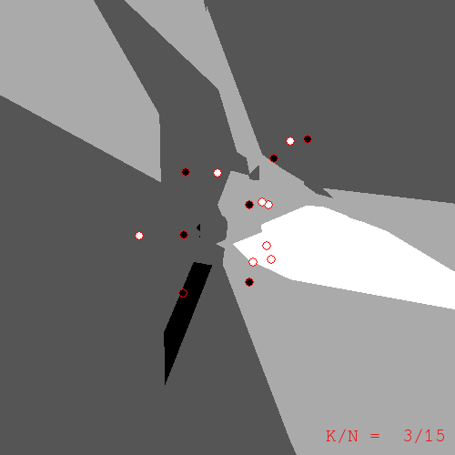

*k=3*

What do we get from these pictures? We should expect to have sharp edges because of the discreteness of $N_k$, the KNN operator. However, what took me by surprise were the islands of color located a distance from the training examples to which they refer. Take the k=2 figure for example. In the upper-right of the image there is an island of black corresponding to those pixels whose nearest neighbors are the two black examples to the north and north-west. If you take a moment to compute the nearest-neighbors for yourself, the island is explained; but, at least for me, I find the islands ugly. They seem too much like artifacts that have no place in a serious learning algorithm. Or perhaps I'm taking them the wrong way; maybe the islands are a sign of the ability of KNN to find hidden meaning in the data. In any case, I would sleep better at night if I had a less quirky replacement for KNN.

## Generalizing KNN as a Weighted Average

If we rewrite the KNN algorithm in a more general form, many other possible regression algorithms will become apparent to us. The generalization proceeds as follows.

Recall the sum by which we defined KNN regression:

$$f(x) = \frac{1}{k} \sum_{i \in N_k[T](x)} y_i$$

We can rewrite this in a more general form that sums over all training examples with weight $\rho$:

$$f(x) = \frac{1}{\eta} \sum_{(x',y') \in T} \rho[T](x,x') \, y'$$

where $\eta$ is a normalizing factor (i.e. the sum of the weights).

When we take the weight $\rho$ to be unity for the k nearest neighbors to $x$ and zero otherwise, this general form reduces to KNN regression.

If we tweak $\rho$ just slightly, we can get an interesting variant of KNN. Instead of taking $\rho$ to be unity for the k nearest neighbors, take $\rho$ to be $\frac{1}{k^2}$ for the $k$th neighbor, and take all neighbors into consideration in this way.

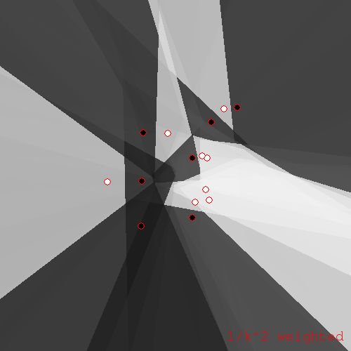

*$\rho = 1/k^2$ variant of KNN*

In both KNN and the $1/k^2$ variant, one will notice that the weight $\rho$ takes the whole set of training examples $T$ as a parameter. This is crucial; without this parameter, an evaluation of $\rho(x,x')$ could not take into account any training examples other than $x'$. Much of the quirkiness of KNN comes from this dependence of the weight on the whole training set.

## KNN's Less Quirky Cousin

If we disallow dependence of $\rho$ on $T$, we obtain a somewhat restricted but still useful subclass of the general weighted average regression which I will call a **separable** weighted average regression, or just **weighted average regression**. The specific algorithms I will look at now further restrict $\rho$ to depend only on the distance between $x$ and $x'$.

So, concretely, we have a regression technique which takes a weighted average of all training example colors, where the weight is a function of the distance between the test point (pixel) and each training example. A reasonable choice of weight function is the [inverse distance](https://en.wikipedia.org/wiki/Inverse_distance_weighting) raised to some power:

$$\rho(x,x') = \frac{1}{|x-x'|^\alpha}$$

The resulting regression function for $\alpha = 8$ looks like this:

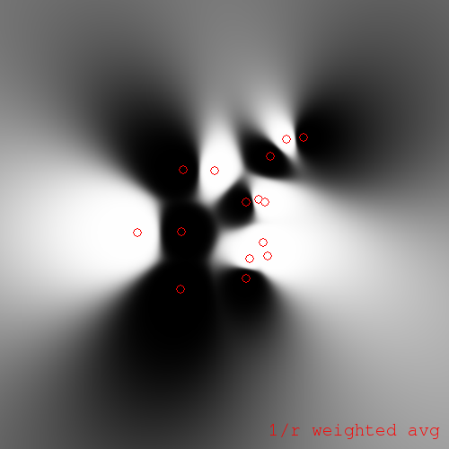

*Inverse distance weighted average regression for $\alpha = 8$*

As $\alpha$ approaches infinity, this weighted average regression approaches KNN regression for $k = 1$.

We can modify the similarity function so as to **soften the weighted average**:

$$\rho(x,x') = \frac{1}{(|x-x'|^2 + a^2)^\alpha}$$

We obtain a regression like the following:

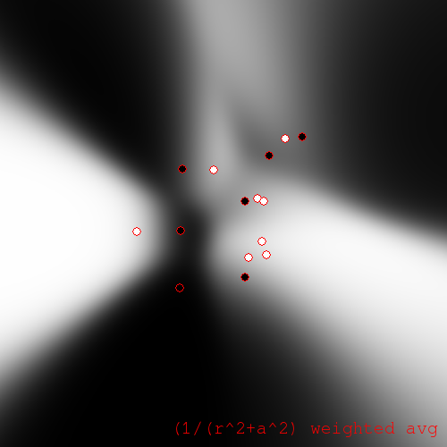

*Softened weighted average regression with $a = 100$ pixels, $\alpha = 32$*

The greyscale of these plots can be difficult to interpret. So, it can be helpful to **coerce** the pixels to be either black or white, where we choose the color that is closest to the greyscale value obtained by regression. (You might call this a classification interpretation.) For the coerced softened weighted average regression we obtain:

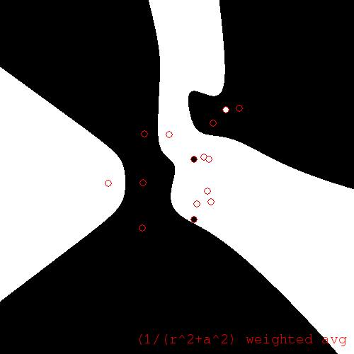

*Coerced softened weighted average regression*

We also obtain interesting plots if we **coerce the unsoftened weighted regression**. Especially if small $\alpha$ are chosen. For $\alpha = 1$ we have:

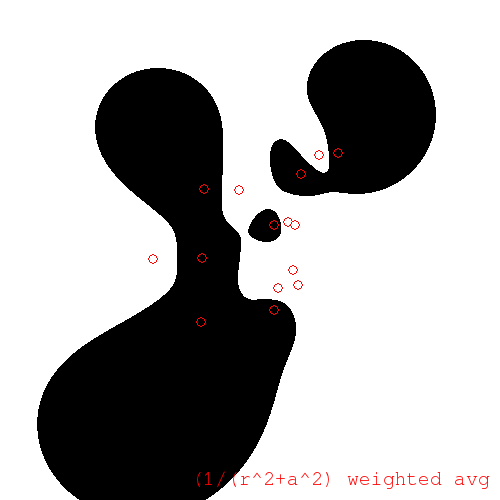

*Coerced unsoftened weighted average regression for $\alpha = 1$*

Notice that the coerced regression becomes white as we travel away from the centroid in any direction. This is because the white training examples outnumber the black ones, and as we move away from the centroid, the distances to each training example become less distinguishable, and we approach a simple average.

We can control the **degree of influence-at-a-distance** using the degree $\alpha$. For example, to decrease the individual influence of points at a distance, placing emphasis instead on the overall white/black ratio, take $\alpha = 0.5$:

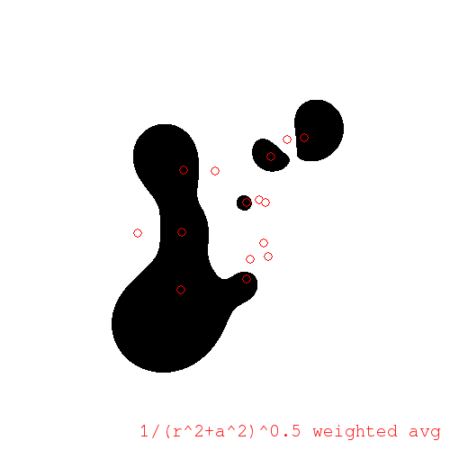

*$\alpha = 0.5$*

Or, to increase individual influence at a distance, take larger $\alpha$, say $\alpha = 2$:

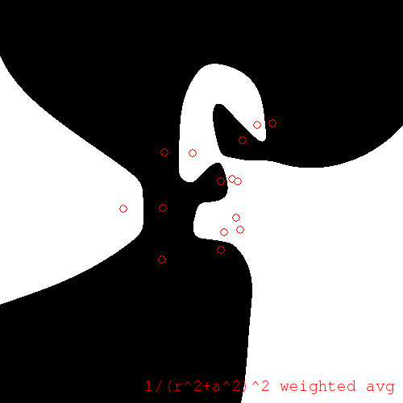

*$\alpha = 2$*

As before, if $\alpha$ goes to infinity, this regression approaches KNN.

## Fun with Iterative Painting

Lastly, I will take a look at an iterative algorithm. The **iterative painting algorithm** starts off with the training examples; it then chooses a test point at random and performs regression at that point; the test point and result are added to the training set, and we loop. Once we are satisfied with the number of samples generated, we can use KNN on the augmented set to obtain our regression function.

For example, using KNN with k=1, a run of iterative painting produced:

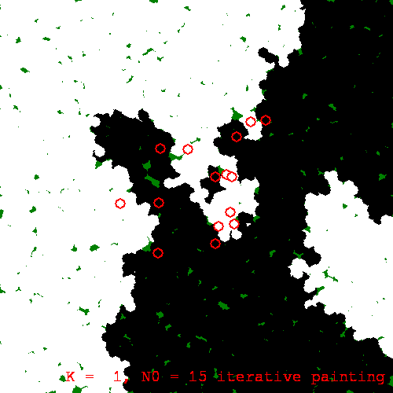

*An iterative painting with k=1*

Now, because iterative painting *evolves* the regression function stochastically --- with future development reliant on earlier, stochastically generated results --- we will observe macroscopic divergence between different runs of the algorithm. This is a sort of [butterfly effect](https://en.wikipedia.org/wiki/Butterfly_effect). Here is another run of the same painting procedure, with the same initial training set, with only the random seed different:

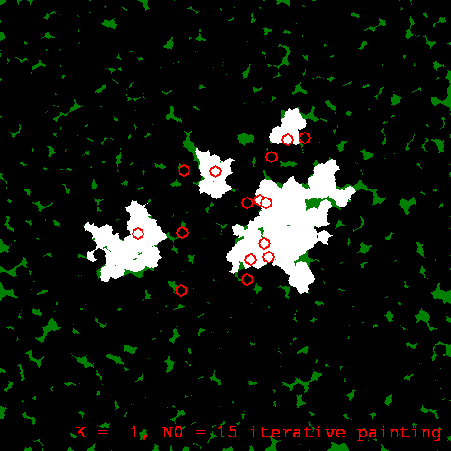

*Another iterative painting of the same training set*

We can run iterative painting with $k > 2$ also. As $k$ increases, the resulting regression functions seem to be more stable w.r.t. the butterfly effect:

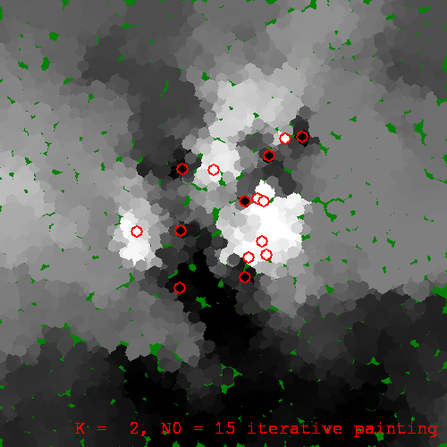

*An iterative painting for k=2*

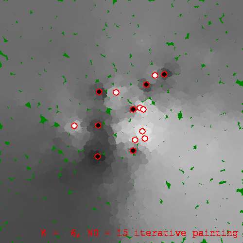

*And with k=6*

Like we did earlier to the weighted average regression, we can **coerce the iterative painting**. This coercion may be done at each iteration (running-coercion), or once at the end of the run (post-coercion). Using running-coercion and k=3, a run produced:

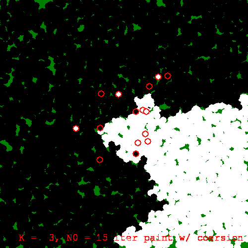

*Running-coerced iterative painting with k=3*

## Conclusion

We have visualized KNN regression and witnessed some of its quirkiness which otherwise might go unnoticed. We then recast KNN as a special case of a more general form. From that general form, we isolated the likely source of the quirkiness, namely inseparability of the weight, and we explored the class of regression algorithms that results when we require separability of weight.

We also looked at the rather whimsical iterative painting algorithm. With the help of the visualizations, it is fairly clear that iterative painting is ill-suited for use in machine learning. This is not to say that iterative augmentation algorithms don't have their place in ML, just that they need to be developed with care. The moral, I suppose, is that visualization is a valuable tool for understanding complexity.

*Originally published on [Quasiphysics](https://quasiphysics.wordpress.com/2011/12/13/visualizing-k-nearest-neighbor-regression/).*
