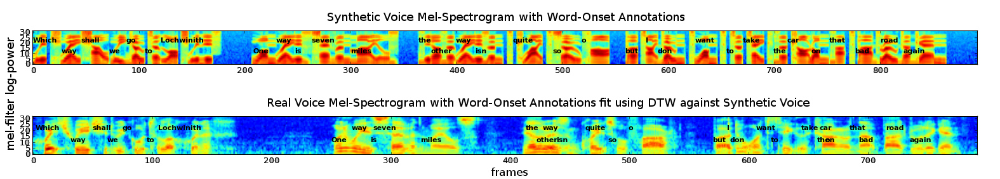
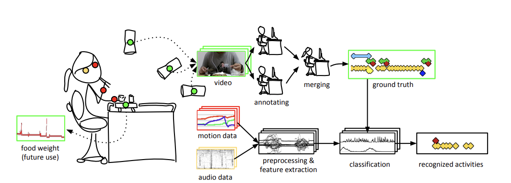

# welcome to my digital lab notebook

## about me

I'm an entrepreneur-engineer, erstwhile researcher, amateur musician and radio operator (W2CAM), and linguaphile. I am co-founder and CTO at **Olibra ([Bond Home](https://bondhome.io))**, where I lead a team building next-generation user experiences for smart home. I've done research in the past in causal inference, and I now wish to contribute to the safe development of machine intelligence.

Research directions I'm particularly interested in:

 - safe AI-assisted/automated embedded systems development
 - user interfaces for agentic coding -- how do we maintain quality and security as we reduce supervision?
 - evaluations of agentic coding against real machines (qemu, attached hardware)
 - byte-based transformers (direct machine code generation)

## current project

I'm currently enrolled in the **Frontier Language Models** Fractal U course.
I'm building [**FuBench**](https://github.com/chrismerck/fubench), a little benchmark framework for evaluating 
mathematical reasoning ability. Right now I'm exploring what kind of questions may have been used in DeepSeek R1 training.

## projects

I'm curious about AI interpretability, so I [reproduced the intro figure](blog/2025/05/14/demonstrating-superposition/)
 from Anthropic's Toy Models of Superposition. I wanted a refresher, so rather than use an autograd I worked out the gradients by hand and implemented in C. My small contribution is animating the embedding during learning which gives a physical intuition about local minima.

---

I've been dabbling with NLP/ML for a long while. Here's a [blog post from 2011 on KNN visualization](https://quasiphysics.wordpress.com/2011/12/13/visualizing-k-nearest-neighbor-regression/) that shows how I can make fully custom figures to communicate mathematical ideas.

---

I once came up with a [backdoor way to align an audio book with the text](https://quasiphysics.wordpress.com/2013/08/08/speech-transcript-alignment/): use even poor quality TTS software that gives timestamps and then use DTW algo to to align the two audio files.

---

At my smart home company, we've watched as each successive LLM opens new home control capabilities. 
Together with a front-end engineer, I built a [home control demo](https://www.youtube.com/watch?v=F_rlwDuOiXU) the morning that `gpt-4o` was released.
The faster inference dropped the latency to the point it made for a compelling demo. I had originally built this on davinci-003 before tool calling was available, and I still used nearly the same prompt with lots of JSON examples. (1) 
{ .annotate }

1. I still think it would be amazing to be able to specify a grammar for the LLM to follow. Should be easy to just condition the output probabilities on being grammatical (provided there's no garden paths :hmm:).

---

Lastly, I also do the mundane stuff that has to happen around the research. Here's a figure I drew for one of Kleinberg Lab's papers in grad school. I wrote the video annotation software and fabricated a custom table in a woodshop in addition to coding the ML pipeline.

## selected papers

- [Causal Explaination](https://github.com/chrismerck/chrismerck.github.io/raw/refs/heads/main/docs/assets/aaai-2016-merck.pdf), AAAI (2016) - Computing the strength of causal relationships between events in a physical model.

- [Physical Model Theory](https://github.com/chrismerck/chrismerck.github.io/raw/refs/heads/main/docs/assets/Merck-Physical_Model_Theory-2010.pdf) (2010) - A broad exploration of the simplest world-models used in physics.

- [Fuzzy Flip-Flops](https://github.com/chrismerck/chrismerck.github.io/raw/refs/heads/main/docs/assets/fuzzy-flip-flop.pdf) (2010) - Relaxes the binary nature of logic gates to explore continuous-valued logic.

- [Finite Machines](https://github.com/chrismerck/chrismerck.github.io/raw/refs/heads/main/docs/assets/finite_machines.pdf) (2009) - A formal exploration of small machines with limited memory.

- [Sunglint Statistics](https://github.com/chrismerck/chrismerck.github.io/raw/refs/heads/main/docs/assets/polarimetry.pdf), Applied Optics (2008) - We study the pattern of light reflected from the ocean surface in order to help remove it from satellite imagery. I'm most proud of the attractor diagrams that reveal structure in the glint time series.

## misc

Otherwise I spend my time doodling on guitar, taking friends foraging, ever so gradually learning Latin, and teaching kids to solder and code. My intent with this site is to share occasional writeups related to work, research, and adjacent. Try the sidebar menu.
