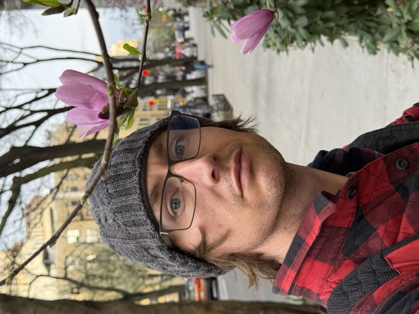
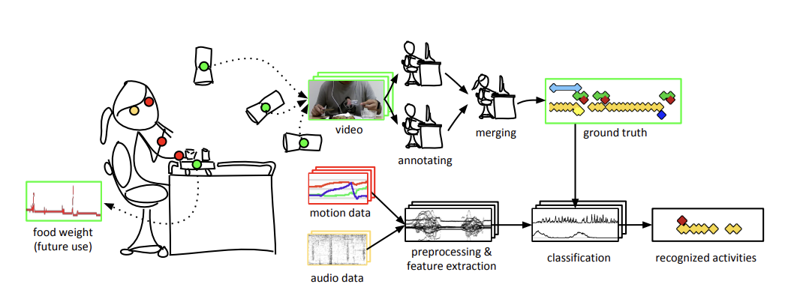

# about me

{ align=right width="200" }

I'm an entrepreneur-engineer, researcher, and linguaphile. 
I am co-founder and CTO at **[Bond Home](https://bondhome.io)**, where I lead a team building smart home experiences.

Someday I want to build highly-effective and enjoyable language learning software.

In the meantime, we've got a lot of work to do ensuring advances in artificial intelligence are aligned with human interests,
and so that is getting my research attentions.

## experiences

I have recently been reading interpretability papers and trying to [reproduce their figures](blog/2025/05/14/demonstrating-superposition/).

I got a small grant to [investigate reasoning failures in DeepSeek models](blog/2025/08/17/locating-reasoning-errors-with-active-sampling/).

I've been dabbling with NLP/ML for a long while, origially inspired by [Manning & Schuetze](blog/2011/06/30/statistical-nlp-book). I'm a fan of [spacial visualizations](blog/2011/12/13/visualizing-knn-regression/) (2011) and [multimodality](blog/2013/08/08/speech-transcript-alignment/) (2013). 

I built a [home control demo](https://www.youtube.com/watch?v=F_rlwDuOiXU) the morning that `gpt-4o` was released.

I studied physics and computer science at [Stevens](stevens.edu), writing a wave tank controller for NASA Wallops, video annotation software to label data for an NIH-funded eating study, and channeled Russel Monroe whenever making figures.

## blog highlights

- [Humpty Dumpty Successfully Annealed](blog/2026/02/19/humpty-dumpty-successfully-annealed-with-aid-of-hungarian-algorithm-and-svd/) (2026) — Solving a Jane Street puzzle: reassembling a neural network's scrambled layers with the Hungarian algorithm and SVD
- [Considerations when Building Embedded Databases](blog/2024/07/24/considerations-when-building-embedded-databases/) (2024) — Pitfalls of persisting device state to flash memory, originally published on Memfault's Interrupt blog
- [Clustering Jane Austen](blog/2011/08/17/clustering-jane-austen/) (2011) — Hierarchical clustering on word bigrams across Austen's novels, with dendrograms and word clouds
- [Easy Syntax Trees](blog/2011/05/02/easy-syntax-trees/) (2011) — An informal diagramming technique applied to English, Chinese, and a long Kafka sentence
- [Korean Kuriosities](blog/2011/05/27/korean-kuriosities/) (2011) — Observations on Hanja, borrowed words, and calligraphy from a trip to Seoul
- [Extending the Knuth Operator](blog/2011/12/18/extending-the-knuth-operator/) (2011) — Exploring fractional extensions of Knuth's up-arrow notation
- [Option Pricing and Brownian Motion](blog/2011/03/29/option-pricing-and-brownian-motion/) (2011) — Connecting stock option pricing theory to the physics of diffusion
- [Playing Genetic Doublets in 3D](blog/2010/12/05/playing-genetic-doublets-in-3d/) (2010) — Lewis Carroll's word ladder game solved with genetic algorithms and embedded in 3D

## selected papers

- [Causal Explaination](https://github.com/chrismerck/chrismerck.github.io/raw/refs/heads/main/docs/assets/aaai-2016-merck.pdf), AAAI (2016) - Computing the strength of causal relationships between events in a physical model.

- [Physical Model Theory](https://github.com/chrismerck/chrismerck.github.io/raw/refs/heads/main/docs/assets/Merck-Physical_Model_Theory-2010.pdf) (2010) - A broad exploration of the simplest world-models used in physics.

- [Fuzzy Flip-Flops](https://github.com/chrismerck/chrismerck.github.io/raw/refs/heads/main/docs/assets/fuzzy-flip-flop.pdf) (2010) - Relaxes the binary nature of logic gates to explore continuous-valued logic.

- [Finite Machines](https://github.com/chrismerck/chrismerck.github.io/raw/refs/heads/main/docs/assets/finite_machines.pdf) (2009) - A formal exploration of small machines with limited memory.

- [Sunglint Statistics](https://github.com/chrismerck/chrismerck.github.io/raw/refs/heads/main/docs/assets/polarimetry.pdf), Applied Optics (2008) - We study the pattern of light reflected from the ocean surface in order to help remove it from satellite imagery. I'm most proud of the attractor diagrams that reveal structure in the glint time series.

## misc

Otherwise I spend my time doodling on guitar, taking friends foraging, ever so gradually learning Latin, and teaching kids to solder and code. My intent with this site is to share occasional writeups related to work, research, and adjacent. Try the sidebar menu.
