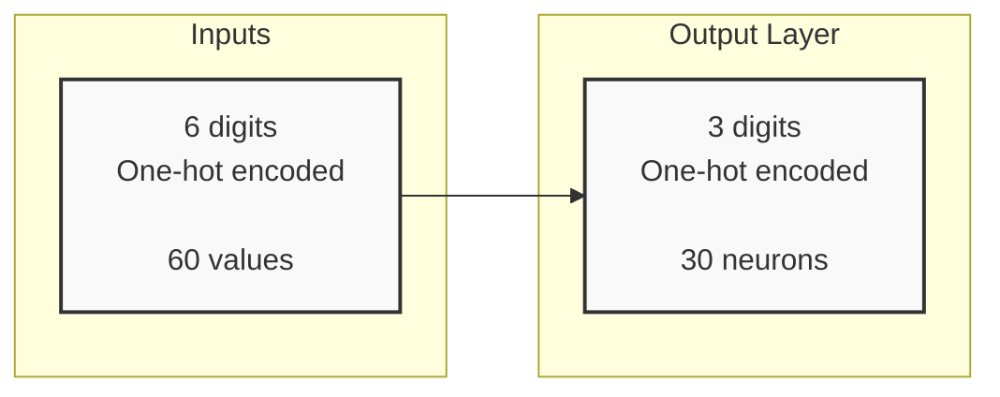
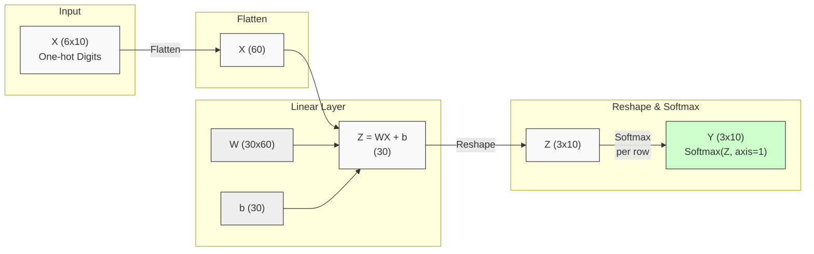

# Three Digit Math

I devoured Heinlein's _Stranger in a Strange Land_ in high school,
so naturally I was excited to hear about neural nets "[grokking](https://en.wiktionary.org/wiki/grok)" three digit addition.
I recall seeing a graph of training and test accuracy over time,
where the training accuracy reaches 100% early on,
but with test accuracy at chance---no generalization---but then after a long period of stasis,
the test accuracy quite suddenly shoots up to 100% also.
The network "grokked" the problem.

So I ask, what's the simplest model I can build that can grok three digit addition?
And, can we look inside and see how it does it?

Now, I could go and read the [paper](https://arxiv.org/abs/2201.02177), but first I'm just going to play around myself.

> "Research is what I'm doing when I don't know what I'm doing." - *Wernher von Braun*

## Dataset

Our dataset will be all 3-digit addition equations
that have 3-digit answers, such as

$$ 123 + 456 = 579. $$

I'll simply enumerate all the equations:

```python
def all_equations():
    for i in range(100, 1000):
        for j in range(100, 1000):
            k = i + j
            if k > 999:
                break
            yield f"{i}+{j}={k}"
```

then shuffle, and split into 90% training and 10% test.

## Embeddings

Now, we need to decide how to encode the digits as vectors.
The simplest approach is to use one-hot encoding,
where each digit is represented as a vector of length 10
with just a single dimension set to 1, the rest set to 0.
So our NN will be learning a mapping:

$$ \mathbb{R}^{6 \times 10} \rightarrow \mathbb{R}^{3 \times 10} $$

For the example above, the input is

$$
X = \begin{bmatrix}
0 & 1 & 0 & 0 & 0 & 0 & 0 & 0 & 0 & 0 \\
0 & 0 & 1 & 0 & 0 & 0 & 0 & 0 & 0 & 0 \\
0 & 0 & 0 & 1 & 0 & 0 & 0 & 0 & 0 & 0 \\
0 & 0 & 0 & 0 & 1 & 0 & 0 & 0 & 0 & 0 \\
0 & 0 & 0 & 0 & 0 & 1 & 0 & 0 & 0 & 0 \\
0 & 0 & 0 & 0 & 0 & 0 & 1 & 0 & 0 & 0 \\
\end{bmatrix},
$$

and the correct output is

$$
Y = \begin{bmatrix}
0 & 0 & 0 & 0 & 0 & 1 & 0 & 0 & 0 & 0 \\
0 & 0 & 0 & 0 & 0 & 0 & 0 & 1 & 0 & 0 \\
0 & 0 & 0 & 0 & 0 & 0 & 0 & 0 & 0 & 1 \\
\end{bmatrix}.
$$

To the network, the input is a 60-dimensional vector,
I've just formatted it as a 6x10 matrix for clarity.

## A First Dumb Model

Let's start with the simplest possible model, one without any hidden layers:



### the math

Let's look at the math for this model. We have a linear transformation of the input:

$$ Z = W X + b $$

where:

- $X \in \mathbb{R}^{60}$ is the input vector
- $W \in \mathbb{R}^{30 \times 60}$ is the weight matrix
- $b \in \mathbb{R}^{30}$ is the bias vector
- $Z \in \mathbb{R}^{30}$ is the pre-activation output

Then applying softmax to get the final output for each digit position $d \in \{0, 1, 2\}$ and each digit class $c \in \{0, 1, ..., 9\}$:

$$ Y_{d,c} = \frac{e^{Z_{d,c}}}{\sum_{c'=0}^{9} e^{Z_{d,c'}}} $$

This gives us probability distributions over the 10 possible values for each of the 3 output digits.

Our little "simplest model" already has 1830 parameters!

### let's fire up tinygrad

So if we visualize the model, we've got a data flow like this:



To be continued...
